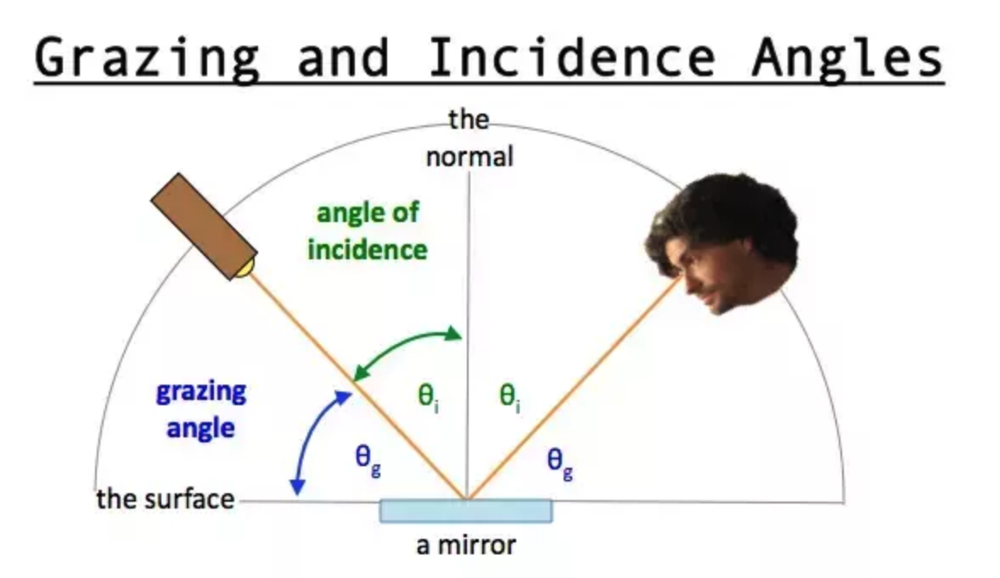
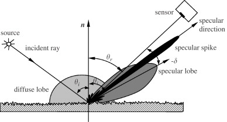

Filament 是一个基于物理的渲染(PBR)引擎。
本文的目的是解释Filament材质和照明模型背后的理论。它只关注算法，并将涉及数学及物理知识。如果你对这部分不感兴趣可以跳过，直接看例子了解Filament的Api，并进行相关开发。

# 基于物理的渲染
 与传统的实时模型相比，基于物理的渲染是一种渲染方法，可以更准确地表示材质以及它们与光的交互方式。 在PBR方法的核心是分离材料和照明，这让我们更容易创建在所有照明条件下看起来准确的真实模型。

# 符号
下面是方程中将会使用到的符号  
符号 | 定义
---|:--:
v | 视角单位向量
l | 入射光单位向量
n | 表面法向单位向量
h | l 与 v之间的半单位向量
f | BRDF
f<sub>d</sub> | BRDF的漫反射分量
f<sub>r</sub> | BRDF的镜面反射分量
α | 粗糙度，使用输入perceptualRoughness重新映射
σ | 漫反射
Ω | 球形域
f<sub>0</sub> | 正常角发生的反射率
f<sub>90</sub> | 入射余角的反射率
χ+(a) | Heaviside函数（如果a> 0则为1，否则为0）
n<sub>ior</sub> | 界面的折射率（IOR）
⟨n⋅l⟩ | 点分量夹逼到[0..1]
⟨a⟩ | 饱和值（夹逼到[0..1]）

## 入射角与掠射角
- 入射角(angle of incidence)
- 掠射角(grazing angle)


## diffuse lobe & specular lobe


## 在图形学中什么是lobe
lobe是定义在直角坐标或极坐标中函数的一个峰值。如cos函数，在0或2pi可以取得峰值。
在照明中，lobe通常对应于反射光的方向，越高的lobe意味着更多的光量。


# Diffuse BRDF

```
float Fd_Lambert() {
    return 1.0 / PI;
}

vec3 Fd = diffuseColor * Fd_Lambert();
```

# Clear coat model
前面描述的标准材质模型很好地适用于单层材料的各向同性表面。不幸的是，多层材料相当普遍，尤其是在标准层之上有一层薄薄的半透明层的材料。真实世界的例子包括汽车涂料、汽水罐、漆木、丙烯酸树脂等。

在标准材料模型的基础上，通过添加第二个镜面波瓣，可以模拟出一个透明的涂层层，这意味着要评估第二个镜面BRDF。为了简化实现和参数化，透明涂层总是各向同性和介电性的。基本层可以是符合标准模型(介质或导体)的任何东西。
因为入射光可以穿过clear coat层，所以必须考虑能量的流失。然而，Filament中的模型不会模拟内反射和折射。


