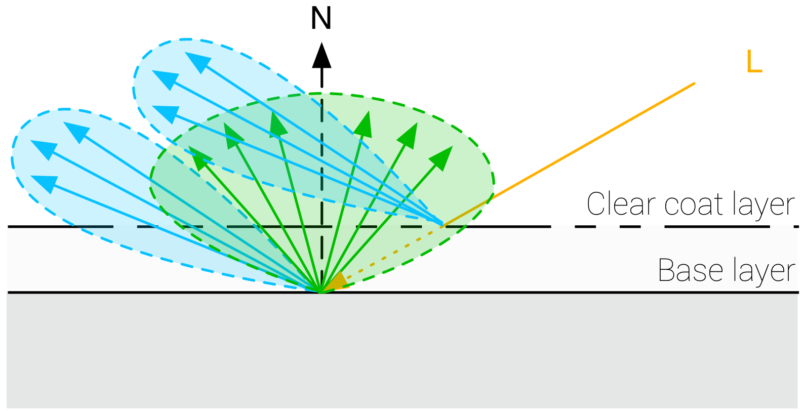

# Fresnel(菲涅尔效应) - 基于物理的渲染
菲涅尔效应模拟了观察者从一个表面上看到的反射光数量取决于观察角度。
例如，当你看一个水池时，如果你已经在水面上，低头向下看可以直接看到水底，如果你离那个水池有一定距离,此时你可以看到水面上强烈的镜面反射。

反射光的数量不仅取决于观察角度，还取决于材料的折射率(IOR)。对于光滑材料,返回的光量接近100%。
菲涅尔公式定义了光在两个不同介质中间的表面上是如何反射和折射的。
```
vec3 F_Schlick(float VoH, vec3 f0, float f90) {
    return f0 + (vec3(f90) - f0) * pow(1.0 - VoH, 5.0);
}
```

# Diffuse BRDF

```
float Fd_Lambert() {
    return 1.0 / PI;
}

vec3 Fd = diffuseColor * Fd_Lambert();
```

# Clear coat model
前面描述的标准材质模型很好地适用于单层材料的各向同性表面。不幸的是，多层材料相当普遍，尤其是在标准层之上有一层薄薄的半透明层的材料。真实世界的例子包括汽车涂料、汽水罐、漆木、丙烯酸树脂等。

在标准材料模型的基础上，通过添加第二个镜面波瓣，可以模拟出一个透明的涂层层，这意味着要评估第二个镜面BRDF。为了简化实现和参数化，透明涂层总是各向同性和介电性的。基本层可以是符合标准模型(介质或导体)的任何东西。
因为入射光可以穿过clear coat层，所以必须考虑能量的流失。然而，Filament中的模型不会模拟内反射和折射。


