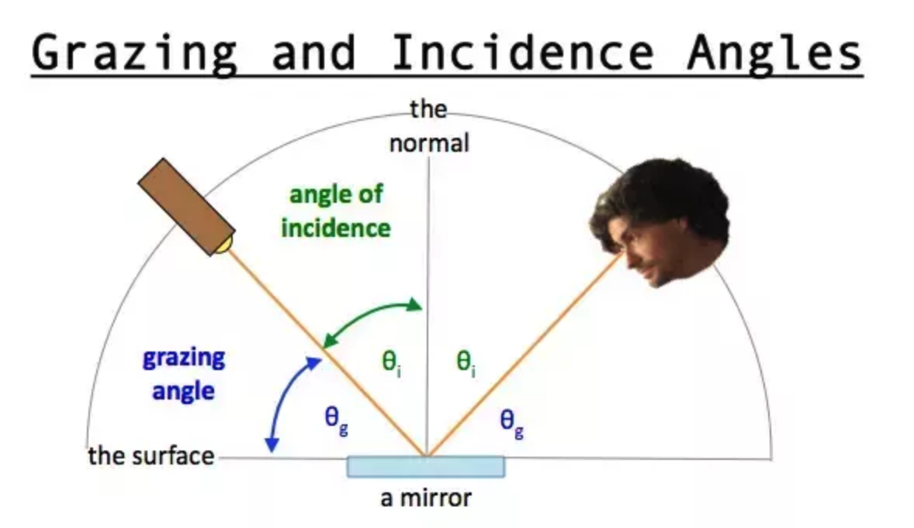
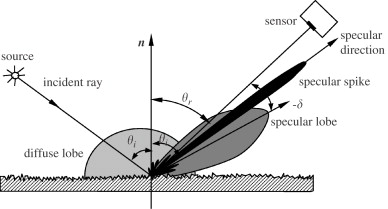
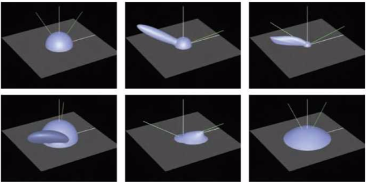
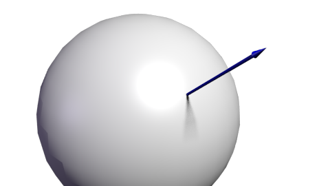
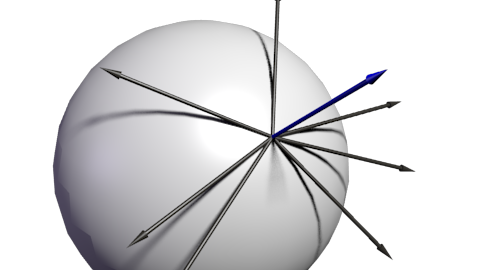
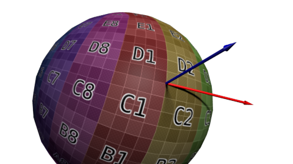
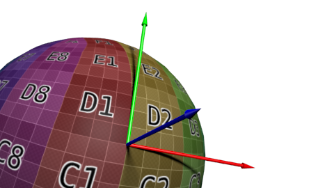
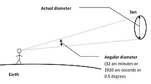
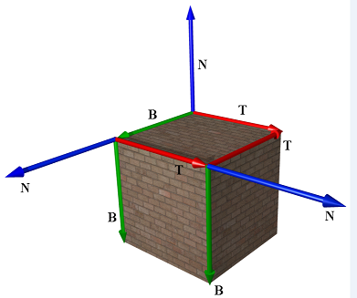

Filament 是一个基于物理的渲染(PBR)引擎。
本文的目的是解释Filament材质和照明模型背后的理论。它只关注算法，并将涉及数学及物理知识。如果你对这部分不感兴趣可以跳过，直接看例子了解Filament的Api，并进行相关开发。

# 基于物理的渲染
 与传统的实时模型相比，基于物理的渲染是一种渲染方法，可以更准确地表示材质以及它们与光的交互方式。 在PBR方法的核心是分离材料和照明，这让我们更容易创建在所有照明条件下看起来准确的真实模型。

## 模型大致分类
- 经验模型(Empirical Models):使用基于实验提出的公式对 BRDF 做快速估计。
- 数据驱动的模型(Data-driven Models):采集真实材质表面在不同光照角度和观察角将 BRDF 按照实 测数据建立查找表，记录在数据库中，以便于快速的查找和计算。
- 基于物理的模型(Physical-based Models):根据物体表面材料的几何以及光学属性建立反射方程，从 而计算 BRDF，实现极具真实感的渲染效果。

## 入射角与掠射角
- 入射角(angle of incidence)
- 掠射角(grazing angle)

## diffuse lobe & specular lobe

## 在图形学中什么是lobe
lobe是定义在直角坐标或极坐标中函数的一个峰值。如cos函数，在0或2pi可以取得峰值。  
在照明中，lobe通常对应于反射光的方向，越高的lobe意味着更多的光量。  
我们通常把lobe译为波瓣。如下图。对 于给定方向的入射光来说，图中显示了出射光的能力分布:在交点附近球形部分是漫反射分 量，因此出射光来任何方向上的反射概率相等。椭圆部分是一个反射波瓣(Reflectance Lobe)。它形成了镜面分量。显然，这些波瓣位于入射光的反射方向上，波瓣厚度对应反射 的模糊性。根据互易原理，可以将这些相同的可视化形成认为是每个不同入射光方向对单个 出射方向的贡献量大小。

## 色差
色差是源于不同波长的光线在玻璃里的色散和折射系数的差异，从而导致不同波长的光线有不同的焦点。

## 切线和副切线（Tangent and Bitangent）

下图中蓝色箭头代表法线

然后是切线T：垂直于法线的向量。但这样的切线有很多个：

这么多切线中该选哪个呢？理论上哪一个都行。但我们必须保持连续一致性，以免衔接处出现瑕疵。标准的做法是将切线方向和纹理空间对齐：

定义一组基需要三个向量，因此我们还得计算副切线B（本可以随便选一条切线，但选定垂直于另外两条轴的切线，计算会方便些），可以将原来的个向量叉乘得到。

## 角半径(Angular radius)
角直径是以角度做测量单位时，从一个特定的位置上观察一个物体所得到的“视直径”。通常用来描述从给定的视角看球体或圆形的大小。换句话说，角直径可以被认为是眼睛或照相机看一个圆的一边到看相对的另一边所要旋转的角度。

## 切线空间(tangent space)
直观地讲，模型顶点中的纹理坐标，就定义于切线空间。普通2维纹理坐标包含U、V两项，其中U坐标增长的方向， 即切线空间中的tangent轴，V坐标增加的方向，为切线空间中的bitangent轴。模型中不同的三角形，都有对应的切线空间，其tangent轴和bitangent轴分别位于三角形所在平面上，结合三角形面对应的法线，我们称tangant轴（T）、bitangent轴（B）及法线轴（N）所组成的坐标系，即切线空间（TBN）。

在立方体中，每个面都有对应的切线空间，每个面由两个三角形组成，该两个三角形中的纹理坐标就基于相应的切线空间。

### 纹理坐标与位置坐标的关系  
纹理坐标与位置坐标，可以通过切线空间联系起来。如下图所示：

