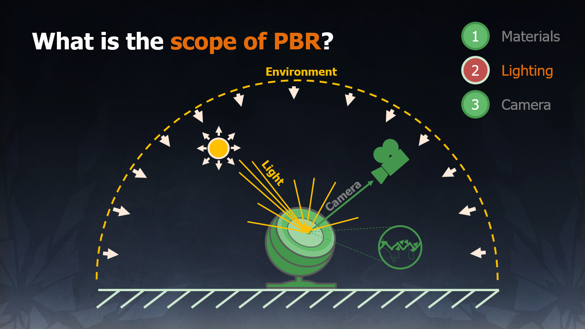

# PBR
基于物理的渲染的范畴，由三部分组成：

- 基于物理的材质（Material）
- 基于物理的光照（Lighting）
- 基于物理适配的摄像机（Camera）

PBR 并不是“一项”技术，它是由一系列技术的集合，并不断改进的结果。

[Moving Frostbite to PBR](https://www.ea.com/frostbite/news/moving-frostbite-to-pb)

[理解PBR：从原理到实现](https://neil3d.github.io/unreal/pbr-theory.html)

[Physically Based Rendering:From Theory To Implementation](http://www.pbr-book.org/)

[SIGGRAPH 2010 Course: Physically-Based Shading Models in Film and Game Production](http://renderwonk.com/publications/s2010-shading-course/)

[SIGGRAPH 2013 Course: Physically Based Shading in Theory and Practice](https://blog.selfshadow.com/publications/s2013-shading-course/)

[Microfacet 模型的反射与折射](https://segmentfault.com/a/1190000000436286)