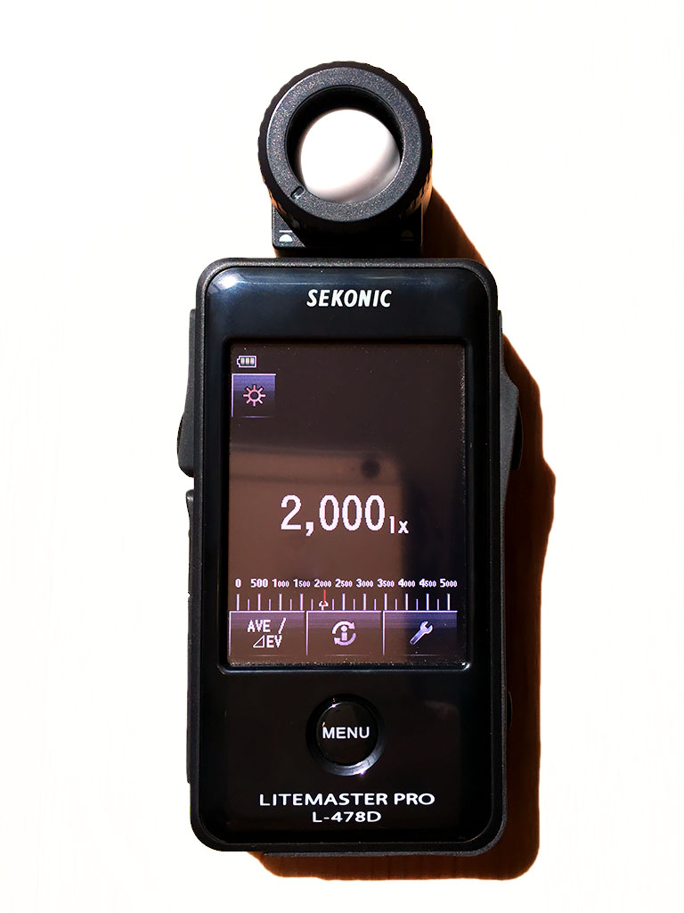
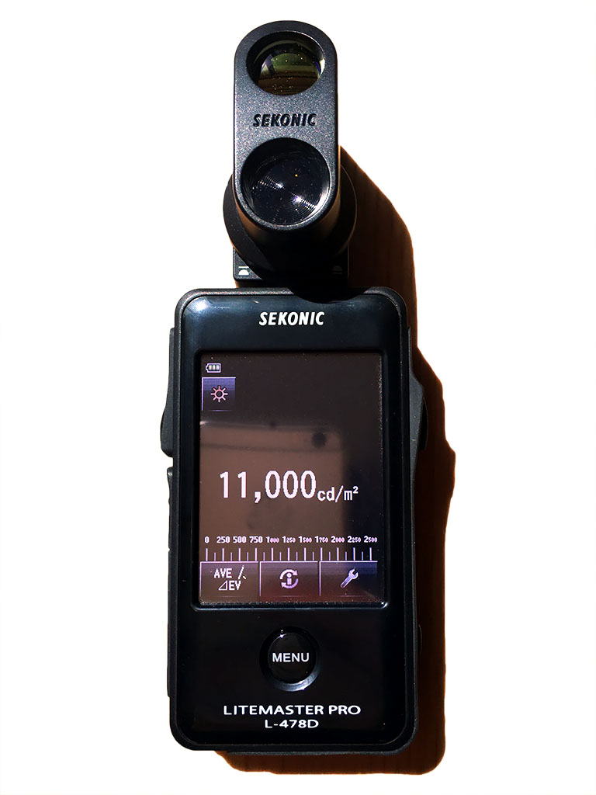

# 单位

接下来会讨论怎么实现各种不同种类的光，实现它们的公式会使用不同的符号和单位。关于符号和单位的总结在下表：

光度术语 | 符号 | 单位
---|:--:|:--:
光通量（Luminous Power或Luminous flux） | Φ | 流明(Lumen, lm)
光强(Luminous intensity) | I | 坎德拉(Candela, cd)
光照度（Illuminance）| E | 勒克斯（Lux，lx）
亮度（Luminance） | L | 尼特(Nit, nt)
辐射功率(Radiant power) | Φe | 瓦特(Watt, W)
光效（Luminous efficacy	）| η | 流明每瓦特(lm/W)
发光效率（ Luminous efficiency）| V | 百分比(%)
下面会详细介绍每个术语

给了获取一致的照明效果，我们必须使用一种能兼顾现实场景中各种光强度之间比例的光照单位。各种光强度之间可能跨度很大，从家用灯泡的800lm到太阳照射的12000lx。

实现照明一致性最简单的方法就是采用光度学单位。这将让我们可以重用照明设备，使用基于物理的相机。

下表描述了我们支持的每种光的种类与光度学单位的对应：

光类型 | 单位
---|:--:|
定向光(Directional light) | 光照度(lx)
点光源(Point light) | 辐射功率(lm)
聚光灯(Spot light) | 辐射功率(lm)
Photometric light | 光强(cd)
Masked photometric light	 | 辐射功率(lm)
区域光 | 辐射功率(lm)
基于图像的光（Image based light） | 亮度（L）

关于辐射功率单位  
很多时候人们会用一个灯泡的功率大小来判断它的亮度。这是错误的，一个灯泡功率多少瓦只说明它会消耗能量的速度，不是它有多亮。
然而，因为许多美术人员习惯于用功率来判断光源的亮度，我们也应该允许用户用功率单位来定义光源的亮度。转换公式如下：

Φ=Φeη

上式中η是光效，表示流明每瓦特。已知最大光效是683(lm/W),我们也能用发光效率V来表示，
Φ=Φe683×V

下面是具体光源参考，完整的见[Wikipedia's luminous efficacy](https://en.wikipedia.org/wiki/Luminous_efficacy)

光类型 | 光效 | 发光效率
---|:--:|:--:|
白炽灯 | 14-35 | 2-5%
LED | 28-100 | 4-15%
荧光灯 | 60-100 | 9-15%

## 光照度
光照度：单位面积上的光通量，度量单位为流明每立方米（lm/m2）  
入射光度计使用白色漫反射圆顶来捕获到达表面的光照度。
  

## 亮度 
亮度：在一定方向上单位面积的光强。

  
## 光强
单位立体角内的光通量，度量单位为流明每立体弧度（lm/sr）,1cd即在给定方向上（该方向上的辐射强度为（1/683）瓦特/球面度））的单位立体角发出的光通量。

光源的发光强度不能直接测量，但如果我们知道测量装置和光源之间的距离，则可以从测量的光照度推算出。

I=E⋅d2

## 光通量
可见光光源在单位时间所发出的光能,功率为1W的555nm波长单色光，对应的光通量为683流明  

## 光效
光源利用能量产生可见光的效率。

参考阅读
- [图形学中的光和辐射学](https://blog.csdn.net/qwertyu1234/article/details/54095832)
- [什么是“光照度（Illuminance）”？](https://www.cnblogs.com/zlbg/p/4049962.html)