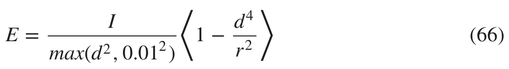

# 直接照明

选择了物理学光单位意味着我们在shader计算出来的是流明单位的值，因此我们所有的估算光的函数都将计算给定节点的亮度L<sub>out</sub>（或出射辐射）。亮度结果基于光照度E和BSDF f(v,l)
L<sub>out</sub> = f(v,l)E

## 平行光
平行光的主要用途是在户外环境创建重要的光源（如太阳和月亮）。平行光就类似于遥远的太阳，由于距离很远很远，随意照射到场景中都是平行光，而且不会随着距离变大而衰减，被照射的整个区域的光强是一样的。虽然现实世界中并不存在平行光，但是我们可以假设如果光源很远的话，那么它发出的光是定向的（即所有入射光线都是平行的，如图所示）。


这个假设对于表面的漫反射是没有问题的，但是对于镜面反射是错误的。寒霜引擎通过把太阳的平行光看做盘状的区域光来解决这个问题。

我们之前选择光照度(lx)作为平行光的单位，部分原因是因为我们可以很容易获得天空和太阳的光照度(从网上找或者自己用仪器测量），还可以简化上一节提到的亮度方程，如下：  

L<sub>out</sub> = f(v,l)E⊥ <n⋅l>

上式中，E⊥是垂直于光源的表面的光照度。例如，加入用平行光源模拟太阳，E⊥就是与太阳光方向垂直的表面的光照度。

下表提供了太阳和天空的光照度参考


GLSL实现：
```
vec3 l = normalize(-lightDirection);
// dot是点乘函数，clamp是夹具函数，取三个数中的中间数
float NoL = clamp(dot(n, l), 0.0, 1.0);

// lightIntensity 垂直入射时的照明度
float illuminance = lightIntensity * NoL;
vec3 luminance = BSDF(v, l) * illuminance;
```

下图展示了模拟正午（照明度设为110,000lx)时，平行光照射一个简单场景的效果。


图：平行光下的一排排不同粗糙度的电介质材质模型

## 精确光源

我们的引擎支持两类精确光源：点光源和聚光灯。这类光源通常在物理上来说并不精确，原因有两个
1. 他们在理论上是无穷小的
2. 他们并不遵循平方反比定律（平方反比定律又称为照度第一定律。它是一个关于光源照度与被照射物体之间距离关系的定律：在点光源的垂直照射下，被照射物体表面的光照度，与光源的发光强度成正比，与光源至被照射物体的表面距离的平方成反比）

第一个问题可以用区域光来处理，但是，鉴于精确光源的开销较低，应该尽可能使用无限小的精确光源。
第二个问题很容易解决，我们去遵循平方反比定律。 
L<sub>out</sub> = f(v,l)E中的E由下式计算得出，其中d是光源至被照射物体的表面距离。  


点光源与聚光灯的不同就在于E是如何计算出来的，特别是光强I是怎么由光通量Φ计算得来。

### 点光源

一个点光源仅由空间中的位置定义，如下图  


点光源的光通量通过在光的立体角上对光强积分得来。由下式，光强可以很容易由光通量推算出来。


Lout=f(v,l)E与57、58联立可得下式：


由上式，亮度可由光通量计算得出。

下图展示了点光源下的简单场景。为了凸显平方反比定律，加强了被照射物体表面的光照度受距离衰减的影响。

### 聚光灯

一个聚光灯由空间中的位置，一个方向矢量和两个(θ<sub>inner</sub> and θ<sub>outer</sub>)所定义。这两个锥角用于定义聚光灯的角度衰减。这个聚光灯模拟函数必须考虑平方反比函数，同时这两个角来模拟亮度的衰减。


同理，聚光灯的光通量也可以由光强计算得来，如下式。与点光源中不同的是使用了外锥角作为积分上限，外围锥角大小范围在[0...π]。


上式在物理学上来说是正确的，另一方面这导致聚光灯有些难用：改变外锥角的大小，会改变光照度级别。观察一下下图，外锥角的减小伴随着光照度级别的提升。


外锥角55°(左)和15°（右）

光照度与外锥角的相互影响意味着美术人员在调节聚光灯的外锥角的同时，也会影响到光照度。给美术人员提供一个可以防止这种相互影响的参数十分有必要。

下式用另一种方式用光强计算光通量，其中没有外锥角，自然不会受其影响。


下图中的测试场景使用了新的公式，果然在锥角不同的情况下，光照度等级一样。


外锥角55°(左)和15°（右）

如果被照射物体表面是磨砂等吸光性能良好的表面，那么上式可以被视为物理上正确的。

故聚光灯模拟函数可以用两种方式表示：

- 对于光的吸收者：


- 对于光的反射者：


### 衰减函数


对于基于物理的精确光源，必须准确评估平方反比定律这一重要因素。上面的数学公式在实现上来说是有问题的：
1. 上面的公式中都会除以距离的平方，当被照射对象与光源相交或接触时，会导致分母为0.
2. 每个光的影响范围是无限的，这意味着想要渲染物理上的一个元素，我们需要评估这个三维世界中的每一束光。

第一个问题我们可以假设每个精确光都是一个很小的区域光。我们可以简单地假设精确光源是一个1cm半径的球体，如下式：


对于第二个问题，我们可以给每个光源设定一个影响范围。这样做有几个好处，工具可以展示给使用者每个光源会影响三维世界中的哪一部分（工具只需要给每个光源画出一个球体表示它的影响范围）。渲染引擎可以在更多地剔除光照，使用者调整影响范围时，就是在帮助渲染引擎剔除。

数学上来说，在快达到影响范围的边界的时候，该处光照度应该平缓地减为0.



下面展示了怎么用GLSL实现基于物理的精确光源。窗口在下式中所描述，其中的r是光的影响范围的半径。
```
float getSquareFalloffAttenuation(vec3 posToLight, float lightInvRadius) {
    float distanceSquare = dot(posToLight, posToLight);
    float factor = distanceSquare * lightInvRadius * lightInvRadius;
    float smoothFactor = max(1.0 - factor * factor, 0.0);
    return (smoothFactor * smoothFactor) / max(distanceSquare, 1e-4);
}

float getSpotAngleAttenuation(vec3 l, vec3 lightDir,
        float innerAngle, float outerAngle) {
    // the scale and offset computations can be done CPU-side
    float cosOuter = cos(outerAngle);
    float spotScale = 1.0 / max(cos(innerAngle) - cosOuter, 1e-4)
    float spotOffset = -cosOuter * spotScale

    float cd = dot(normalize(-lightDir), l);
    float attenuation = clamp(cd * spotScale + spotOffset, 0.0, 1.0);
    return attenuation * attenuation;
}

vec3 evaluatePunctualLight() {
    vec3 l = normalize(posToLight);
    float NoL = clamp(dot(n, l), 0.0, 1.0);
    vec3 posToLight = lightPosition - worldPosition;

    float attenuation;
    attenuation  = getSquareFalloffAttenuation(posToLight, lightInvRadius);
    attenuation *= getSpotAngleAttenuation(l, lightDir, innerAngle, outerAngle);

    vec3 luminance = (BSDF(v, l) * lightIntensity * attenuation * NoL) * lightColor;
    return luminance;
}
```

### 光度学灯(Photometric lights)

光度学灯是一种非常实用和有效的照明的方式，但同时艺术家对光分布没有足够的控制权。建筑照明领域通过考虑以下因素来设计用户友好的照明系统：
- 提供的光的数量
- 光的颜色
- 光在空间中的分布

我们截止到目前的照明系统已经可以满足前两个因素，我们还需要满足第三个因素。光的分布对于室内场景、某些室外场景甚至是道路照明。下图展示了美术人员调节光的分布后的效果。这种需要在展示类场景中特别常见，如博物馆、画展。


图：控制光的分布

光度学灯用光度学配置文件描述光的强度分布。配置文件有两类格式：IES（Illuminating Engineering Society）和
EULUMDAT (European Lumen Data format)，我们只关注前者。IES有着广泛的支持，虚幻4，寒霜，Renderman, Maya and Killzone都支持它。另外，许多灯具厂商也通常会提供IES照明配置。当光源有部分被遮盖时，光度学配置对于测量灯具非常有用。这些灯具会在特定角度遮挡光线发射，因此会改变光的分布。


图：光度学配置可以描述现实世界的灯具

一个IES配置文件保存了所测量光源不同角度上的光强。这个球状的坐标系统通常被称为光度网，可以在[IESviewer](http://www.photometricviewer.com/)看到可视化后的光度网。下图，展示了在Renderman工具中XArrow IES配置的光度网。


图：XArrow IES配置文件渲染出的光度网和3D空间中的一个点光源

IES格式的文档资源很少，想要理解它最好的文档应该是[Parsing the IESNA LM-63 photometric data file](http://lumen.iee.put.poznan.pl/kw/iesna.txt)。间接地说，IES文件保存了光源周围不同角度上的光强。对于测量每个的水平角度时，还会提供不同垂直角度的一系列发光强度。然而，测量光源水平对称是相当常见的。上面的XArrow文件就是一个不错的例子：光强随垂直角度而变化，但在水平角度上对称。在IES文件中，垂直角度的范围是0-180度，水平角度的范围是0-360度。


下图展示了用我们的**lighten**工具渲染一系列IES文件的效果图。


IES文件能直接用于我们的点光源或聚光灯。实现思路是这样的，我们必须首先对IES文件进行处理，并生成一个光度学文件作为纹理。出于性能考虑，我们生成的那个纹理是1D的，它存储的是某个特定垂直角度上所有水平角度的平均光强（这里一个像素代表一个垂直角度）。如果真的要表现光度学灯光，我们应该使用2D纹理，但是另一方面，大部分光在同一与水平面上是对称的，所以这样的近似计算其实可以接受。

#### 光度学文件
光强来自文件中，从一维纹理采样得到的所有值都将简单乘以最大强度。为了方便起见，我们还提供了乘数。

在渲染时，可以将光度学文件应用在衰减计算上。下面的方程表述了点光评估函数。


其中Ψ(l)项就是光度衰减函数。它受光矢量和光的方向影响。聚光灯已经具有方向矢量，但是我们还需要为光度学点光源引入一个方向矢量。

GLSL实现：
```

```

## 相关阅读

[一文带你读懂IES文件数据以及配光曲线](http://www.guangdianzi-sh.com/index.php/new/index/g/c/id/26.html)
