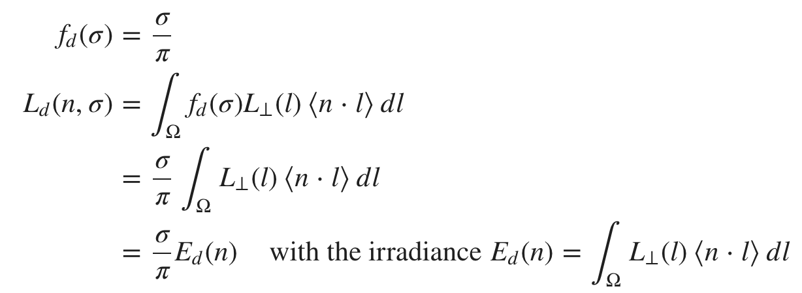
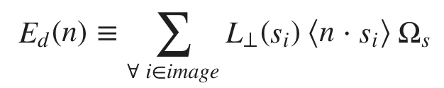
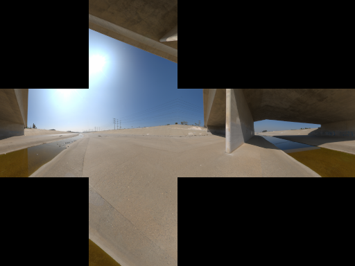

# 漫反射BRDF积分

使用Lambertian BRDF[7](#7), 我们得到辐射L:

或者由积分的定义，有：

Ωs是与i有关的[固定角度](#8)

辐射照度度积分Ed可以很简单，即使很慢，为了在运行时高效访问，可以预先计算并存储到立方体贴图中。通常，**image**是一个cubemap。σ/π项独立于IBL，并在运行时添加以获取辐射L。 

图：环境cubemap

图：使用Lambertian BRDF的辐射照度图

然而，辐射照度E可以通过分解成[球谐函数]()来大大减小运行时的开销。通常最好避免在移动设备上获取纹理并释放纹理单元。即使E已经存储在cubemap中，在渲染前利用球谐函数分解预计算会快上几个数量级。

球谐函数分解在概念上与傅里叶变换相似，它在频域的正交基上表达信号。我们最感兴趣的是：
- 很少因子需要⟨cosθ⟩计算
- 具有圆对称性的点的卷积开销很低，并且可以作为球谐函数空间中的乘积

**7Lambertian BRDF不取决于l,v或Θ,所以Ld(n,v,Θ)≡Ld(n,σ)**  
**8对于cubemap, Ωs 可由 2π/6⋅width⋅height 近似**

[球谐光照（Spherical Harmonics Lighting）及其应用-实验篇](https://lianera.github.io/lianera.github.io/post/2016/sh-lighting-exp/)