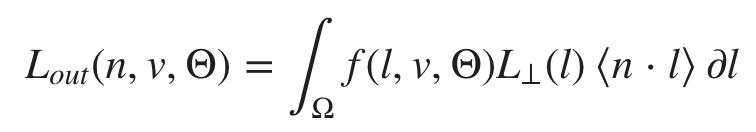
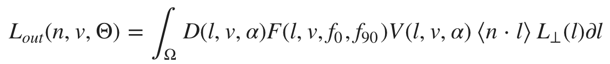
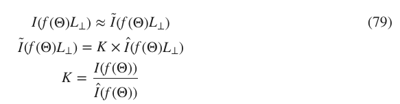
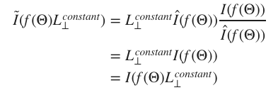
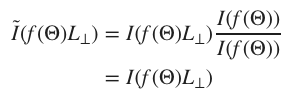

# 镜面BRDF积分

如我们上面所见，辐射亮度(Lout)由IBL的辐射照度与BRDF的交互作用产生：

我们认识到Lout与f(l,v,Θ)⟨n⋅l⟩的卷积，即使用BRDF作为内核过滤环境。实际上，在更高的粗糙度下，镜面反射看起来更加模糊。

在上式中加入**f**的表达式,得：

在积分中，表达式取决于v,a,f0和f90，这样的话计算开销十分大,不适合在移动设备上实时渲染。

## 简化BRDF积分

因为没有合适的解决方案和简单的方式去计算Lout积分，我们用一个简化的式子来代替: I^,我们会在该式中假设v=n,故视角向量v总是等于平面法线n。

这个简化会对常量环境产生严重的影响，因为它影响了结果的常数（即DC）项的大小。我们使用比例因子K来修复，K可以保证平均辐射照度还是正确的。
- I 是初始的积分，即：I(g)=∫Ωg(l)⟨n⋅l⟩∂l
- I^是当v = n时的简化积分
- K是维持平均辐射照度不变的比例因子
- I~是最后的对I的近似，I~ = I^ x K

由上式，当L⊥为常量时,I~ = I，即：

因此，v=n时L⊥为常量，故v=n时,I~ = I

