# 镜面BRDF积分

如我们上面所见，辐射亮度(Lout)由IBL的辐射照度与BRDF的交互作用产生：

我们认识到Lout与f(l,v,Θ)⟨n⋅l⟩的卷积，即使用BRDF作为内核过滤环境。实际上，在更高的粗糙度下，镜面反射看起来更加模糊。

在上式中加入**f**的表达式,得：

在积分中，表达式取决于v,a,f0和f90，这样的话计算开销十分大,不适合在移动设备上实时渲染。

## 简化BRDF积分

因为没有合适的解决方案和简单的方式去计算Lout积分，我们用一个简化的式子来代替: I^,我们会在该式中假设v=n,故视角向量v总是等于平面法线n。

这个简化会对常量环境产生严重的影响，因为它影响了结果的常数（即DC）项的大小。我们使用比例因子K来修复，K可以保证平均辐射照度还是正确的。
- I 是初始的积分，即：I(g)=∫Ωg(l)⟨n⋅l⟩∂l
- I^是当v = n时的简化积分
- K是维持平均辐射照度不变的比例因子
- I~是最后的对I的近似，I~ = I^ x K

由上式，当L⊥为常量时,I~ = I，即：

因此，v=n时L⊥为常量，故v=n时,I~ = I

在近似中，我们把辐射亮度L⊥分为两部分，平均部分：L⊥-和差值部分：ΔL⊥。我们计算时对平均部分进行完整正确的积分，对差值部分简化的计算积分。
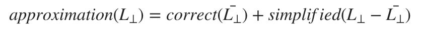

代入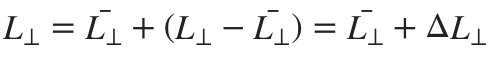得

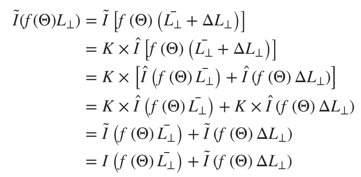

我们再看看各项：  

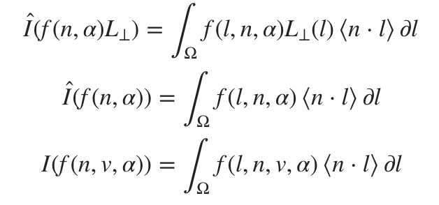

以上三式都可以很容易地预计算并存储在查询表中。

## 离散域

在离散域中，上式变成：

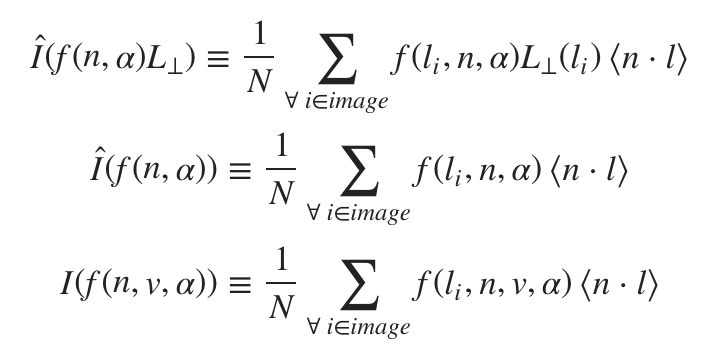

然而，实际上我们会基于重要性采样，并加入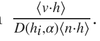项。

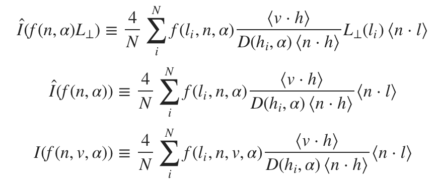

之前提到过对于I^,我们假设v = n,则上式可以简化为：

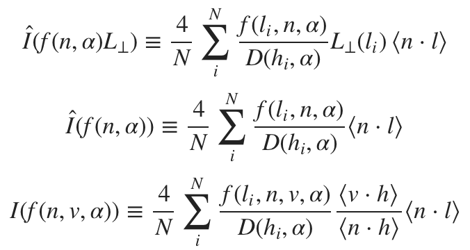

然后可以将前两个方程合并，使得LD(n,a) = 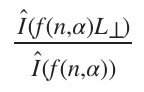，即

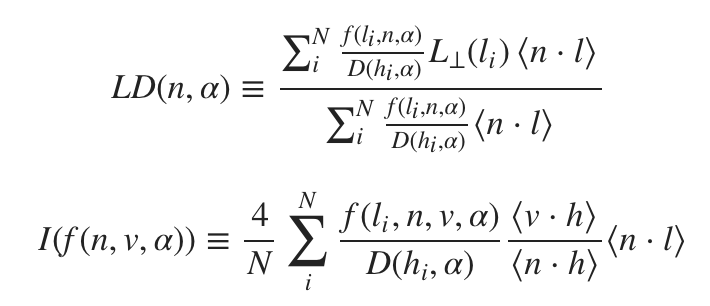

此时，上两式已经差不多可以提前计算了。唯一的困难点是我们在预计算这些积分的时候并不知道f0和f90,所以我们只能假设f0 = f90 = 1(菲涅耳项总是为1)。

我们还需要处理BRDF的可见性项，这里我们也将V置为1.

即：

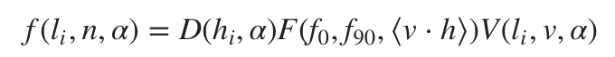

在BRDF中，D(hi,α)被分母消去,同时F和V项也可以消去，因为我们假设他们的值为1.

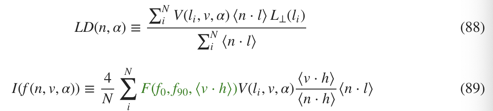

让我们将菲涅耳项代入方程89：

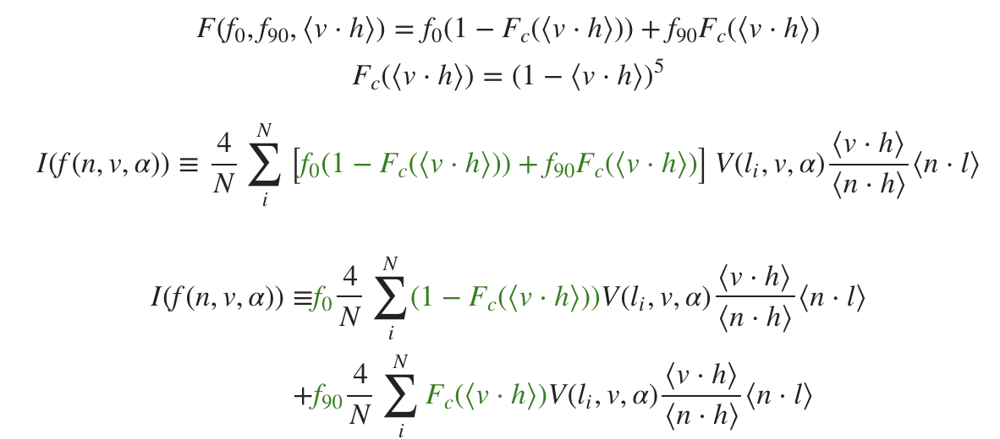

最后，我们把可以预计算的方程（即没有f0和f90这两个运行时参数的部分）提取出来：

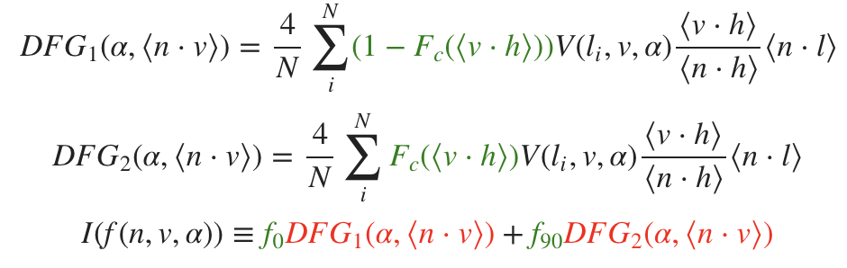

我们发现DFG1和DFG2都仅取决于n⋅v,即法线n和视线方向v的夹角。

结合以上所有方程，得：

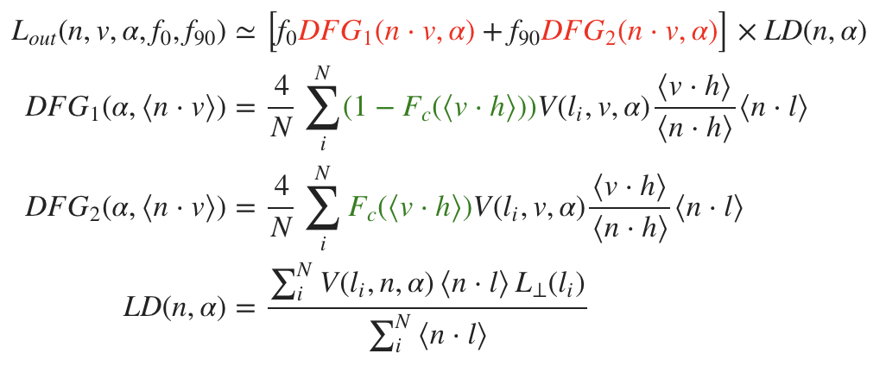

