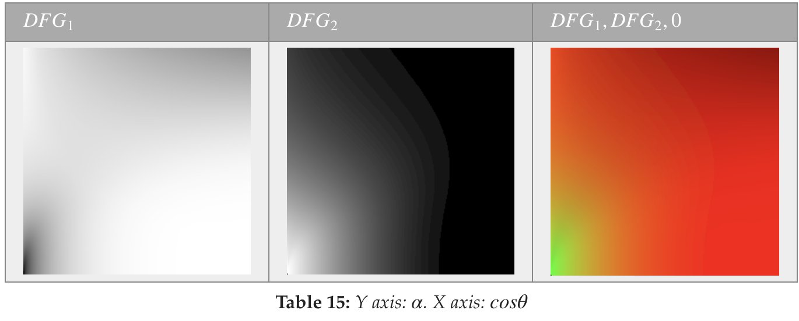

# 可视化DFG1和DFG2项

DFG1和DFG2都可以在以(n⋅v,α)索引的常规2D纹理中进行预计算，并进行双线性采样，也可以在运行时使用 解析近似的表面计算。下表就是预计算出的纹理。C++实现见[9.5]()。

DFG1和DFG2在[0, 1]范围内，然而8-bits纹理由于精度不足可能会有问题。不幸的是，移动设备不一定支持16-bits纹理且采样器有限。尽管使用纹理的简洁着色器代码很好，但最好使用解析近似。OpenGL ES 3.0的RG16F纹理格式就是一个好的选择。

下表展示了这些近似：

