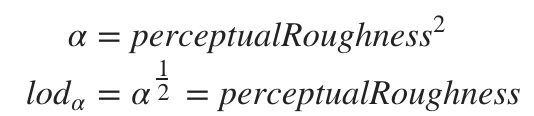
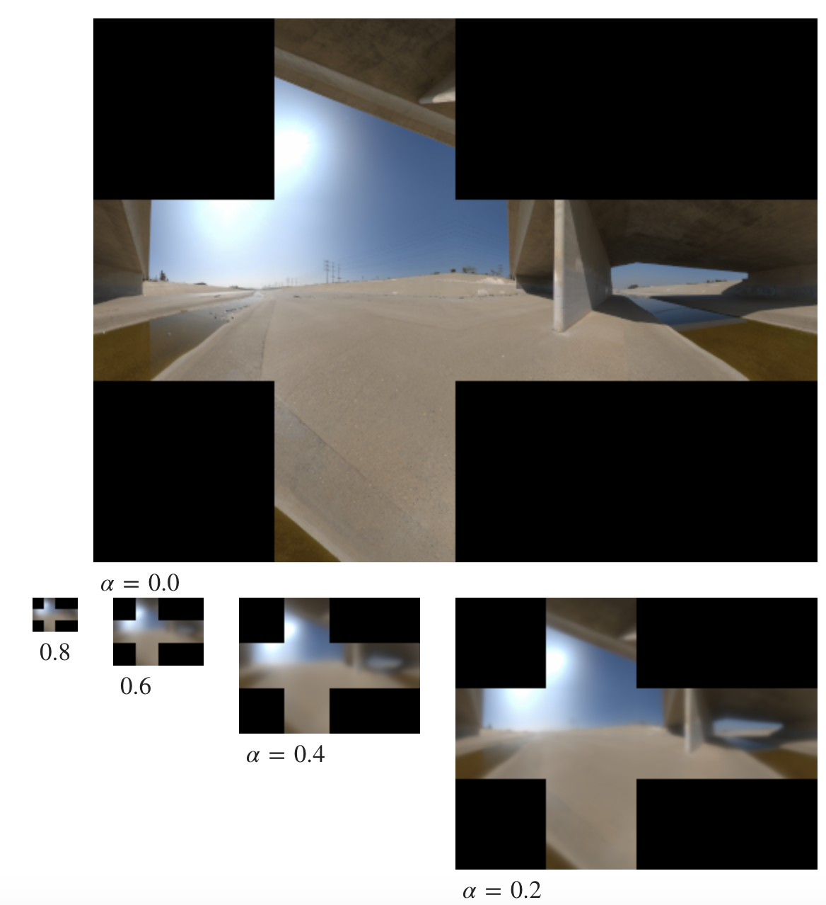

## LD项可视化

LD是环境的卷积，其函数仅取决于α参数（其与roughness相关）。LD可以很方便地存储在mipmap过的cubemap中，其中越来越多的LOD(Levels of Detail)会接受随着粗糙度增加而预先过滤的环境。这很好，因为该卷积是一个强大的低通滤波器。为了更好利用每一mipmap等级,对α进行重映射是有必要的，我们发现使用指数为2的映射很方便实现而且效果不错。

例子如下：

## 参考阅读

