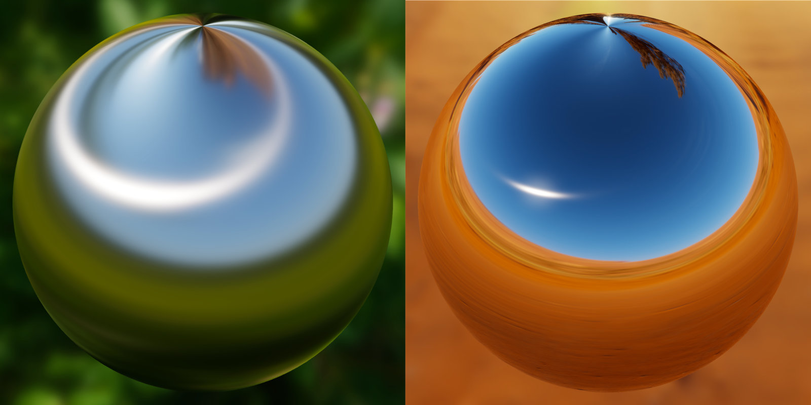
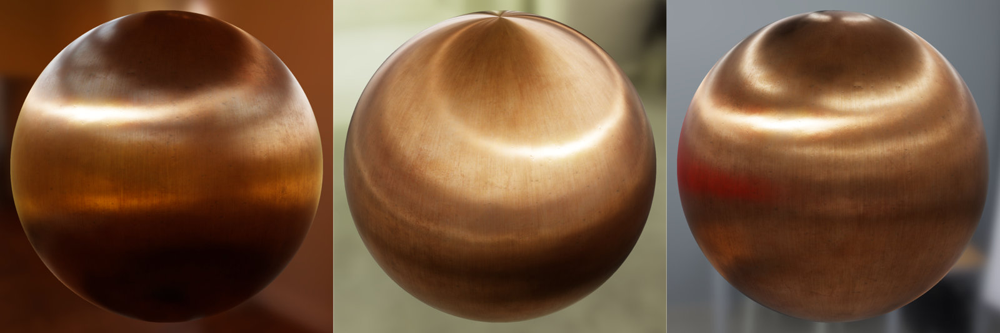
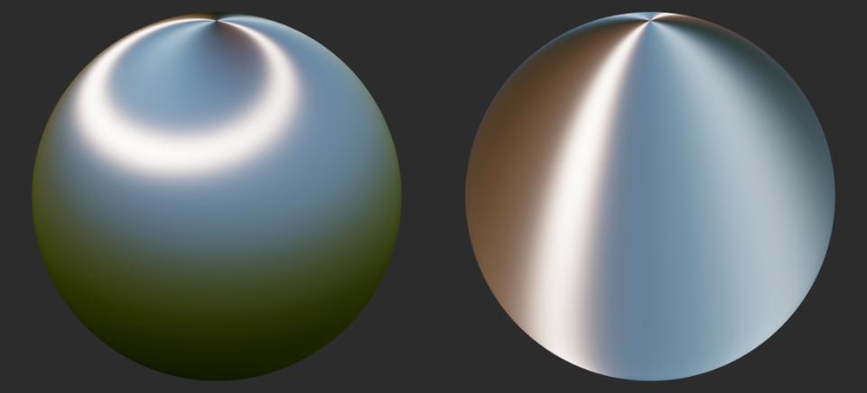

# 各向异性

[McAuley15](#McAuley15)基于[Revie12](#Revie12)描述了一个叫“弯曲反射矢量”的技术。“弯曲反射矢量”是对各向异性光的粗略近似，还有另一个选择就用重要性采样。这个近似在近似开销上足够低，而且效果不赖，见下图：


图：使用弯曲法线的各向异性间接镜面反射(左：粗糙度0.3，右：粗糙度0；各向异性都为1)。


图：不同粗糙度，金属性下的各向异性反射

GLSL实现：
```
vec3 anisotropicTangent = cross(bitangent, v);
vec3 anisotropicNormal = cross(anisotropicTangent, bitangent);
vec3 bentNormal = normalize(mix(n, anisotropicNormal, anisotropy));
vec3 r = reflect(-v, bentNormal);
```

同时它还应该可以接受负的各向异性值，当各向异性为负时，高光不再是在切线方向上而是在负切线上。

```
vec3 anisotropicDirection = anisotropy >= 0.0 ? bitangent : tangent;
vec3 anisotropicTangent = cross(anisotropicDirection, v);
vec3 anisotropicNormal = cross(anisotropicTangent, anisotropicDirection);
vec3 bentNormal = normalize(mix(n, anisotropicNormal, anisotropy));
vec3 r = reflect(-v, bentNormal);
```


图：各向异性正值（左）和负值（右）


<span id="McAuley15">[McAuley15]Stephen McAuley. 2015. Rendering the World of Far Cry 4. GDC 2015.</span>
<span id="Revie12">[Revie12]Donald Revie. 2012. Implementing Fur in Deferred Shading. GPU Pro 2, Chapter 2.</span>