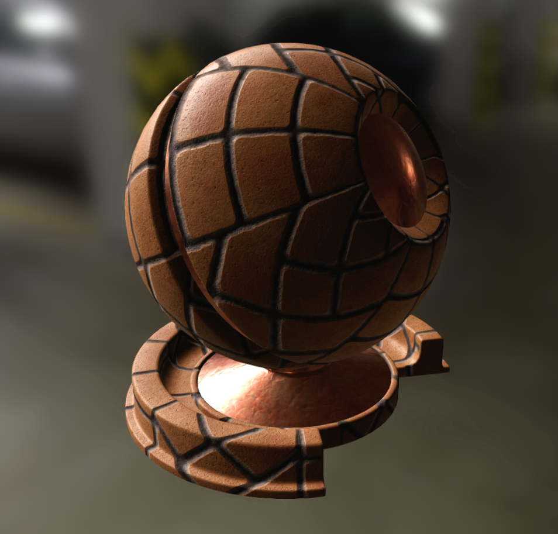

# 基于图像的光照(Image Based Lighting)

在开始之前，我们先来了解下什么是基于图像的光照(IBL)。一个物体，不会单独的存在一个空空的环境里面，它的周围一定有其他的物体。当光源照射到其他物体上的时候，一定也会反射，其中就有很多反射的光线会反射到该物体上去。

一般来说，我们通过一张环境贴图(Environment Map)来保存一个物体周围的环境信息，然后通过某种处理，来实现丰富的环境光照效果。

在现实世界中，光来自每个方向，光的来源要么是光源，要么是环境中其他物体反射的光（这些反射的光已经部分被吸收）。某种角度上说，物理周围的环境都可以被视为光源。图像，特别是cubemaps，都是表现这种环境光的载体。这就是基于图像的照明（IBL)，有时候也称为间接照明。

上图展示的物体只由基于图像的环境光点亮。

IBL有一些制约因素。很明显，环境光贴图需要在我们使用前进行预处理。通常我们会先获取到环境光贴图,或者是在运行时由引擎生成，无论哪种方式，都需要本地和远处探针。
这些探针被用于获取远处或本地环境。在本文中，我们会关注远处环境探针，我们会假设光来自与无穷远的地方，这意味着物理表面上的每一点都使用一样的环境贴图。

物理表面上的某一点上的光线都来源于整个环境，这称为辐照度（irradiance, E)。从物理表面反弹的光线被称为辐射亮度(Lout)。入射光必须始终应用于BRDF的漫反射和镜面反射部分。

Lout来源于IBL的辐照度与一个材质模型(BRDF)f([Θ](#Θ))的相互作用，计算如下：

注意，这里我们关注的是宏观层面上某个平面的表现（不要与微观层面的方程混淆了），所以它只取决于n和v（n是表面法线单位向量,v是视图单位向量）。本质上，我们将BRDF应用于来自各个方向且以IBL编码的“点光源”。

## IBL类型

现代渲染引擎有四种IBL的类型：
- 远距离光照探针：用于在“无穷远”处（视差可以忽略）获取光照信息。遥远探针通常包含天空，遥远的景观特征或建筑物等。它们要么被引擎获取，要么作为HDRI（high dynamic range image)被摄像机获取。
- 本地光照探针：用于获取在某一特定角度下世界中的一个区域。根据周围几何体，获取物被投影在立方体或球体上。本地探针要比远距离探针更加精确，而且在给材质添加本地反射上特别有用。
- 平面反射：通过渲染由镜像于平面的场景来获取反射。这一项只作用于平坦的表面，如地板、道路和水。
- 遮蔽空间反射：光线到深度缓冲区中是

另外，我们必须把静态IBL和动态IBL区分开来。要实现一个完全动态的白天/黑夜循环需要动态地重新计算远距离探针。平面和遮蔽空间反射都是动态的。

Θ代表材质模型f的参数，如：粗糙度，反反射率等等

### IBL 单位

之前我们提到过，我们所有的光照都使用物理单位。同样地我们的IBL会使用亮度(cd/m2),其也是我们直接照明部分所有公式的输出单位。

我们对高动态范围图像(HDRI)的处理会更加精细。相机不记录测得的亮度值，而是会记录与设备相关的值，该值仅与原场景亮度相关。因此，我们必须给美术人员提供一个乘数，允许他们能够恢复或接近原始的绝对亮度。

要正确地为IBL重建HDRI的亮度，需要美术人员不仅仅只是简单地对环境拍照，还要记录下额外的信息：
- 色彩校正：用[灰卡](https://www.mediacollege.com/lighting/equipment/gray-card.html)或[MacBeth ColorChecker](https://en.wikipedia.org/wiki/ColorChecker)
- 相机设定：光圈、快门和ISO
- 亮度样本：用亮度测量仪

### 处理光探针

之前提到过，我们计算IBL的辐射亮度是通过在微表面半球上积分。因为这个计算对于实时渲染来说，开销过大，我们必须首先对光探针进行预处理。

下面的两个部分将会讨论用于加速光探针检测的技术：

- 镜面反射率：
- 漫反射反射率：

Θ代表了材质模型f的参数，如：粗糙度：环境光等等
