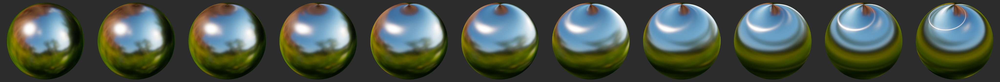

# 各向异性模型
前面的标准材质模型只可以描述各向同性表面。许多现实世界中的材质，比如拉丝金属，只能用各向异性模型进行描述。


图：各向同性材质（左）和各向异性材质（右）的对比

## 各向异性镜面BRDF
前面的各向同性镜面BRDF修改一下就可以处理各向异性模型了。Burley通过使用各向异性GGX和NDF来实现：


不幸的是，这个NDF公式额外还需要两个参数，a<sub>t</sub>-切线上的粗糙度， a<sub>b</sub>-副切线上的粗糙度（切线与副切线的介绍见基础知识部分）。  
Kulla提出一种方法可以使用anisotropy参数来从a<sub>t</sub>推导出a<sub>b</sub>。该方法描述了这两个粗糙度参数之间的关系。


请注意，除正常方向外，此NDF还需要切线和副切线方向（法线贴图也需要这两个参数）。

GLSL实现：
```
float at = max(roughness * (1.0 + anisotropy), 0.001);
float ab = max(roughness * (1.0 - anisotropy), 0.001);

float D_GGX_Anisotropic(float NoH, const vec3 h,
        const vec3 t, const vec3 b, float at, float ab) {
    float ToH = dot(t, h);
    float BoH = dot(b, h);
    float a2 = at * ab;
    highp vec3 v = vec3(ab * ToH, at * BoH, a2 * NoH);
    highp float v2 = dot(v, v);
    float w2 = a2 / v2;
    return a2 * w2 * w2 * (1.0 / PI);
}
```

## 各向异性参数化
各向异性材质模型除了之前标准模型的所有参数，还要再加上一个额外的参数：

参数 | 定义
---|:--:
Anisotropy | 各向异性的量。范围在-1到1
其值为负数时，就会在副切线上呈各向异性，而不是切线方向。




