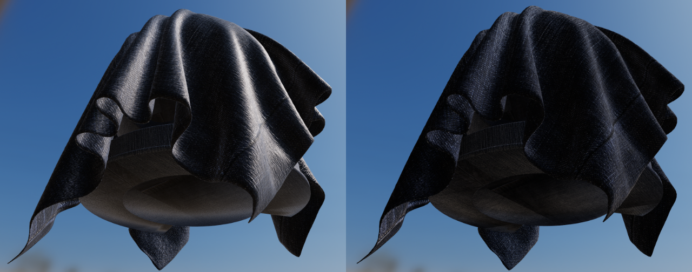

# 布料模型（Cloth model）

前面描述的所有材料模型都是在宏观和微观层面上模拟致密表面的。然而，衣服和布通常由松散连接的线组成，这些线会吸收并散射入射光。前面介绍的微面BRDFs算法在表现布的的时候做得很差，因为它们的基本假设是基于表面由随机分布的无数个光滑微平面构成。与致密平面相比，布的特点是较柔和的镜面波瓣，较大的衰减和模糊的光照效果。

下图展示了传统的微平面 BRDF对于表现牛仔面料的无力，渲染出来的效果让人感觉很僵硬（几乎像塑料一样），更像是一块油布而不是一块牛仔面料。它表明了重现因为吸收和散射引起的柔和镜面波瓣对于渲染布是多么重要。


传统的微平面 BRDF(左)和新的布料BRDF（右）渲染一块牛仔面料时的对比

天鹅绒是布料模型的一个有趣的用例。下图中，由于前向和后向散射，天鹅绒边缘表现出强烈的照明效果。这种散射现象是由直立在布表面的纤维引起的。当入射光与观察方向相反时，纤维将向前散射光。类似地，当入射光与观察方向方向相同时，纤维将向后散射光。


值得注意的是，有些类型的织物，例如皮革、丝绸最好使用硬表面材质模型（标准或各向异性材质模型）。

## 布料镜面BRDF
我们使用的布料镜面BRDF是由Ashikhmin 和 Premoze提出的修改过的微平面BRDF。他们注意到法线分布函数是对BRDF影响最大的，并且计算阴影、遮蔽对于天鹅绒这种材质模型来说不是必须的。这有助于实现模糊照明（向前和向后散射），同时添加偏移以模拟前向镜面反射。所谓的天鹅绒NDF定义如下：


完整的镜面BRDF，参考[Neubelt13](#Neubelt13):


实现：
```
float D_Ashikhmin(float roughness, float NoH) {
    // Ashikhmin 2007, "Distribution-based BRDFs"
	float a2 = roughness * roughness;
	float cos2h = NoH * NoH;
	float sin2h = max(1.0 - cos2h, 0.0078125); // 2^(-14/2), so sin2h^2 > 0 in fp16
	float sin4h = sin2h * sin2h;
	float cot2 = -cos2h / (a2 * sin2h);
	return 1.0 / (PI * (4.0 * a2 + 1.0) * sin4h) * (4.0 * exp(cot2) + sin4h);
}
```


<span id="Neubelt13">David Neubelt and Matt Pettineo. 2013. Crafting a Next-Gen Material Pipeline for The Order: 1886. Physically Based Shading in Theory and Practice, ACM SIGGRAPH 2013 Courses.</span>


## 光泽颜色
为了更好地控制布料的外观并使用户能够创建双色镜面反射材质，我们引入了直接修改镜面反射率的功能。下图展示了使用参数"sheen color"的效果


没有（左）和有（右）光泽的蓝色布

## 布料漫反射BRDF

我们的布料材质模型依然是基于Lambertian漫反射BRDF。但是我们会稍作修改，来实现能量守恒（类似于透明图层模型中的能量守恒），并提供一个可选的次表面散射选项。

首先是没有次表面散射项的漫反射公式：


F(v,h)是布料镜面BRDF的菲涅耳项。

加上次表面散射：


下图可以看到这种开销较低的次表面散射近似的效果：


白布（左）与棕色次表面散射的白布（右）

布料BRDF的完整实现，包括了光泽颜色和可选的次表面散射
```
// specular BRDF
float D = distributionCloth(roughness, NoH);
float V = visibilityCloth(NoV, NoL);
vec3  F = sheenColor;
vec3 Fr = (D * V) * F;

// diffuse BRDF
float diffuse = diffuse(roughness, NoV, NoL, LoH);
#if defined(MATERIAL_HAS_SUBSURFACE_COLOR)
// energy conservative wrap diffuse
diffuse *= saturate((dot(n, light.l) + 0.5) / 2.25);
#endif
vec3 Fd = diffuse * pixel.diffuseColor;

#if defined(MATERIAL_HAS_SUBSURFACE_COLOR)
// cheap subsurface scatter
Fd *= saturate(subsurfaceColor + NoL);
vec3 color = Fd + Fr * NoL;
color *= (lightIntensity * lightAttenuation) * lightColor;
#else
vec3 color = Fd + Fr;
color *= (lightIntensity * lightAttenuation * NoL) * lightColor;
#endif
```

## 参数化
布料材质有之前标准模型中除了metallic 和 reflectance之外的所有参数，还有两个额外的参数：
参数 | 定义
---|:--:
SheenColor | 用于创建双色镜面反光布料的镜面色调（默认为0.04以匹配标准反射率）
SubsurfaceColor | 材质散射和吸收后的漫反射色彩

如果想创造出类似天鹅绒的材质，可以把base color设为黑（或深色）。要创建更常见的布料，如牛仔布，棉布等，请使用base color进行着色，并使用默认的sheen color或将sheen color设置为base color的亮度。