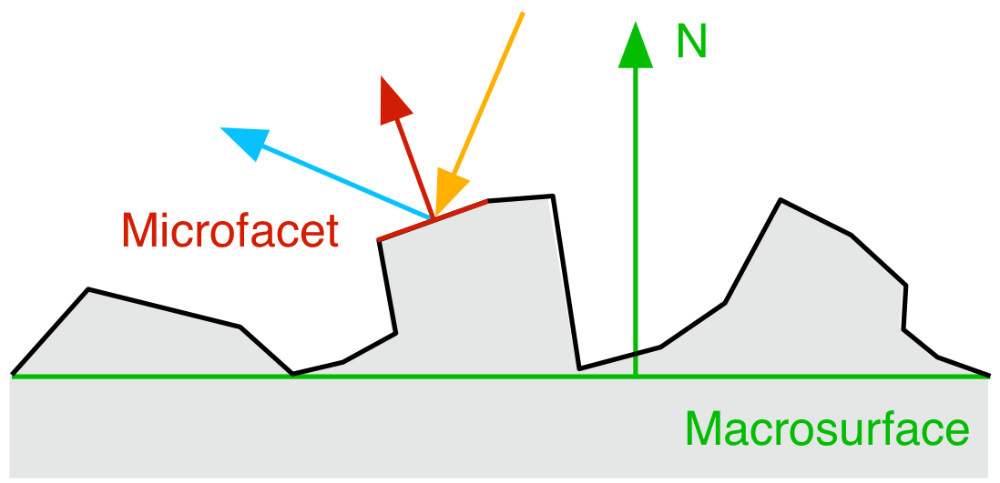
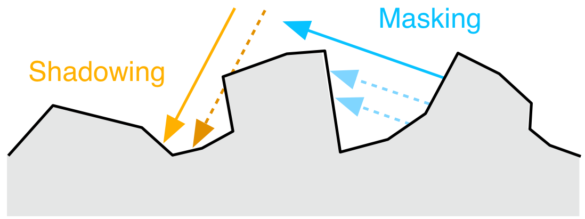
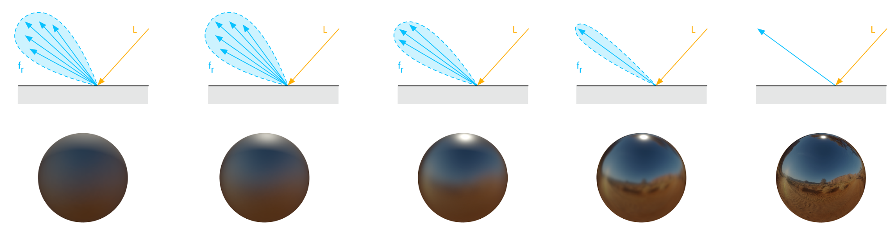

# 标准模型
由于我们的目标是模拟常见的表面，我们的标准材料模型将专注于BRDF并忽略BTDF。因此，我们的标准模型只能正确模拟反射，各向同性，电介质或导电的表面。

BRDF将标准材料的表面响应描述为由两个术语组成的函数：
- 漫反射分量，fd
- 镜面反射分量, fr

表面，表面法线，入射光和fd,fr之间的关系如[图1](figure_1)所示（我们现在忽略次表面散射）：

图1：光与使用BRDF模拟的表面相互作用时的漫反射分量fd和镜面反射分量fr

整个表面反射能被以下等式描述：  
  
这个等式仅仅描述了材质表面对来自单一方向的入射光的反射。完整的渲染方程需要在整个半球上积分。

通常，材质表面都不是平坦的，因此我们需要一个能够描述光与不规则平面相互作用的模型。

我们这里应该会联想到运用微积分的思想。在微观上看，我们可以将表面视为由无穷多个微平面随机排列而成，并且假设这些微平面都是光学平滑的。每个微平面都会以略微不同的方向对入射光反射，而最终的表面外观是所有微平面反射的聚合结果。下图展现了一个平坦表面与一个微观上不规整的表面的不同。
  
图二：用无数微平面模拟的不规整表面（左）与平坦表面（右）

只有位于光方向与视线方向中间的微平面会反射可见光
  
  
图三：微平面

然而，不是所有具有方向正确的法线的微平面都会产生反射光，因为BRDF会考虑遮蔽和阴影。见下图：
 
图四：微平面的掩蔽(Shadowing)和遮蔽(Masking)

微平面BSDF同时很大程度上被微表面的粗糙度所影响。表面越光滑，能反射进入摄像机视角的微表面越多，反射光越明显。表面越粗糙，朝向相机的方向越少，入射光在反射后就会从相机中散射出来，从而使镜面高光变得模糊。下图展示了不同粗糙程度的表面与光是如何与它们作用的
 
图5：不同粗糙程度（从左到右，粗糙到光滑）
 

> 关于粗糙度  
> 用户能设置的粗糙度参数名为 perceptualRoughness

微平面模型被下面这个等式描述：
 

D(m,α)描述的是微平面的分布(正态分布函数),该函数在表面外观上起主要作用。

G(v,l,m)模拟了微平面的可见性（掩蔽或遮蔽）

这个等式对于镜面反射和漫反射分量都有效，差异在于微平面BRDF fm。

这个等式在微观层面上对Ω微分区域进行积分
 
图6：在单个点表面对建模需要在微观层面积分

上图中，在宏观层面，表面被视作平坦的。我们假设由某一方向发射的一缕光点亮的阴影区域对应于表面上的某一点，这样可以帮助我们简化等式。

在微观层面上，表面是不平坦的，因此我们不能再假设只有一缕光了,但是我们可以假设这一微平面内的入射光是平行。由于微平面会在给定一束平行入射光线的情况下将光散射到不同方向，因此我们必须在表面上的半球上积分。

对于每个阴影微分段，计算整个微平面半球的积分实际上不太现实。因此我们会基于镜面反射分量和漫反射分量求近似。

微积分思想的一个经典的运用是用小矩形模拟曲线。
 

## 相关阅读
[微积分的本质 - bilibili](https://www.bilibili.com/video/av24325548/?p=8)