# 镜面的BRDF
Cook-Torrance 反射模型

在镜面反射中，f<sub>m</sub>是一个可以用菲涅耳定律建模的镜面BRDF，注意一下微平面模型积分的Cook-Torrance近似中的大F。

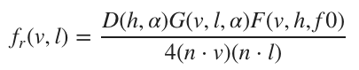 

考虑到我们要进行实时渲染（这是一大限制），我们只能对D，G和F都只取近似值。[Brian Karis. 2013. Specular BRDF Reference](http://graphicrants.blogspot.com/2013/08/specular-brdf-reference.html)为这三个近似提供了相关的理论与公式, 都可用于Cook-Torrance镜面的BRDF。下面会介绍这逐一介绍这三个近似所使用的公式。

## 法线分布函数（大D）
Burley发现长尾法线分布函数(NDF, long-tailed normal distribution functions)很适合用于现实世界中的材质表面。在[Walter](https://knarkowicz.wordpress.com/2014/12/27/analytical-dfg-term-for-ibl/)中描述的GGX分布是一个在高光中长尾衰减和短峰值的分布,这个简单的公式很适合用在实时渲染。在现代物理渲染器中，它也是一种比较流行的模型，与Trowbridge-Reitz分布类似。

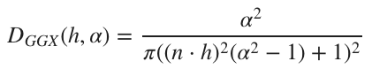   

NDF的GLSL实现如下，简单又高效。
```
float D_GGX(float NoH, float roughness) {
    float a = NoH * roughness;
    float k = roughness / (1.0 - NoH * NoH + a * a);
    return k * k * (1.0 / PI);
}
```
接下来是在数学上对该公式的化简。

我们可以用来改进这个实现。同时在使用半精度浮点数前，我们还需要对原公式进行改进。因为在使用半精度浮点数时，计算1-（n · h)<sup>2</sup>会有两个问题。
1. 当（n · h)<sup>2</sup>接近1时会有浮点消除。
2. n · h在1附近时精确度不够。   

解决方案与拉格朗日相关：
|a x b|<sup>2</sup> = |a|<sup>2</sup>|b|<sup>2</sup> - (a · b)<sup>2</sup>  
因为n和h都是单位向量，所以|n x h|<sup>2</sup> = 1 - (n · h)<sup>2</sup>。我们就直接用1 - (n · h)<sup>2</sup>计算叉积。

下面是我们优化后对大D的实现
```
#define MEDIUMP_FLT_MAX    65504.0
#define saturateMediump(x) min(x, MEDIUMP_FLT_MAX)

float D_GGX(float roughness, float NoH, const vec3 n, const vec3 h) {
    vec3 NxH = cross(n, h);
    float a = NoH * roughness;
    float k = roughness / (dot(NxH, NxH) + a * a);
    float d = k * k * (1.0 / PI);
    return saturateMediump(d);
}
```

## 几何阴影（大G）
[Heitz](#Heitz)表示Smith几何阴影函数十分适用于表示大G。Smith公式如下：

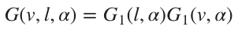   

G<sub>1</sub>可以依次遵循几个模型，通常设置为GGX公式：

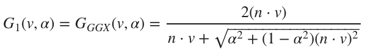   

故整个Smith-GGX公式变成：

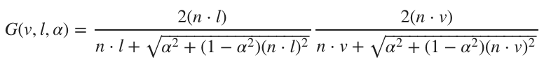   

因为在分子上有2(n · l)和2(n · v)相乘，通过引入可见性函数V可以让我们很容易地简化原公式

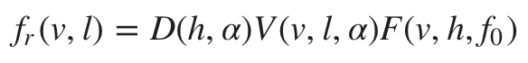   

其中V函数为：
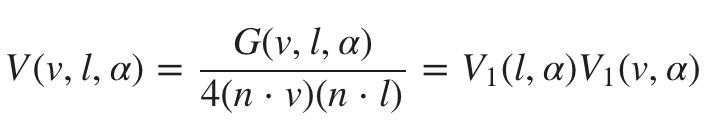   

同时  
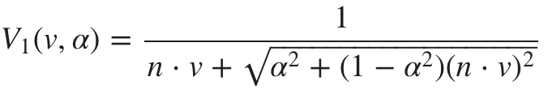   

Heitz还提到如果将微平面的高度与掩蔽、遮蔽的关系考虑在内会得到更准确的结果。因此他定义了高度相关的Smith函数：

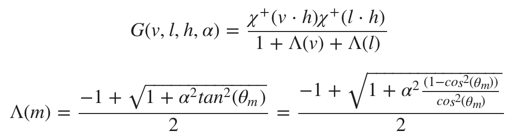   

将θ<sub>m</sub>替换为n · v, 我们会得到：

   

演算得到：

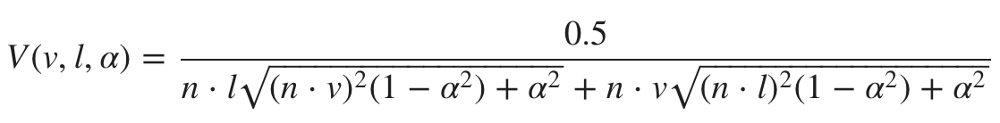   

对可见性函数的GLSL实现如下，因为其中有两个开方运算，所以在运算成本上会有点高。
```
float V_SmithGGXCorrelated(float NoV, float NoL, float roughness) {
    float a2 = roughness * roughness;
    float GGXV = NoL * sqrt(NoV * NoV * (1.0 - a2) + a2);
    float GGXL = NoV * sqrt(NoL * NoL * (1.0 - a2) + a2);
    return 0.5 / (GGXV + GGXL);
}
```

因为在根号中的数都有进行平方运算，并且他们的值都在[0,1]内，我们可以对可见性函数做一个近似：

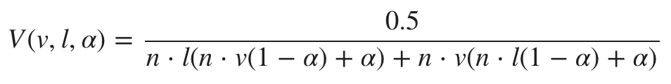  
这个近似在数学上还说是错误的，但是减少了两个开方操作，并且这个近似在移动应用上进行实时渲染是足够用的。
GLSL的实现：
```
float V_SmithGGXCorrelated(float NoV, float NoL, float roughness) {
    float a2 = roughness * roughness
    float GGXV = NoL * (NoV * (1.0 - a) + a)
    float GGXL = NoV * (NoL * (1.0 - a) + a)
    return 0.5 / (GGXV + GGXL)
}
```

## 菲涅耳(镜面大F)
菲涅耳效应在基于物理模拟的材质上至关重要。该效应模拟了一个现象：观察者从一个表面上看到的反射光数量取决于观察角度。例如，当你看一个水池时，如果你已经在水面上，低头向下看可以直接看到水底，如果你离那个水池有一定距离,此时你可以看到水面上强烈的镜面反射。即我们所看到的光线会根据我们的观察角度以不同强度反射。  
菲涅耳方程(Fresnel equations)是一组用于描述光在两种不同折射率的介质中传播时的反射 和折射的光学方程。


反射光的数量不仅取决于观察角度，还取决于材质的折射率(IOR)。对于光滑材料,返回的光量接近100%。
- **若有一束入射光（入射方向垂直于表面，即从法线方向入射或者说入射角为0），则把它反射回来的光记为f<sub>0</sub>**,并且它可以从折射率计算得出。  
- **在掠射角内反射回来的光记为f<sub>90</sub>**, 对于柔顺的材质，该值接近100%。

菲涅耳公式定义了光在两个不同介质的交界面上是如何反射和折射的，或者是反射光与入射光能量之比。
[Schlick](#Schlick94)描述了一个Cook-Torrance镜面BRDF中对菲涅耳效应的近似，这个近似减小了开销。

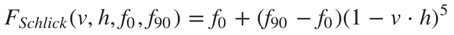
其中常量f<sub>0</sub>代表了沿法线方法入射的入射光的镜面反射率，并且其会在电解质上消色，在金属体上保留彩色。其真实值取决于表面的折射率。
下面是GLSL实现：
```
vec3 F_Schlick(float VoH, vec3 f0, float f90) {
    return f0 + (vec3(f90) - f0) * pow(1.0 - VoH, 5.0);
}
```

菲涅耳函数可以被视为对f<sub>0</sub>和f<sub>90</sub>的插值。
现实世界中的材质中无论是电介质还是导体都在掠射角处呈现消色镜面反射，并且菲涅耳反射率在90°时为1.0。  
假如设置f<sub>90</sub>为1，通过稍微重构代码就能对菲涅耳定律的Schlick近似的标量运算进行优化。
```
vec3 F_Schlick(float VoH, vec3 f0) {
    float f = pow(1.0 - VoH, 5.0);
    return f + f0 * (1.0 - f);
}
```

<span id="Heitz"> Eric Heitz. 2014. Understanding the Masking-Shadowing Function in Microfacet-Based BRDFs. Journal of Computer Graphics Techniques, 3 (2).</span>
<span id="Schlick94"> Eric Heitz. 2014. Understanding the Masking-Shadowing Function in Microfacet-Based BRDFs. Journal of Computer Graphics Techniques, 3 (2).</span>