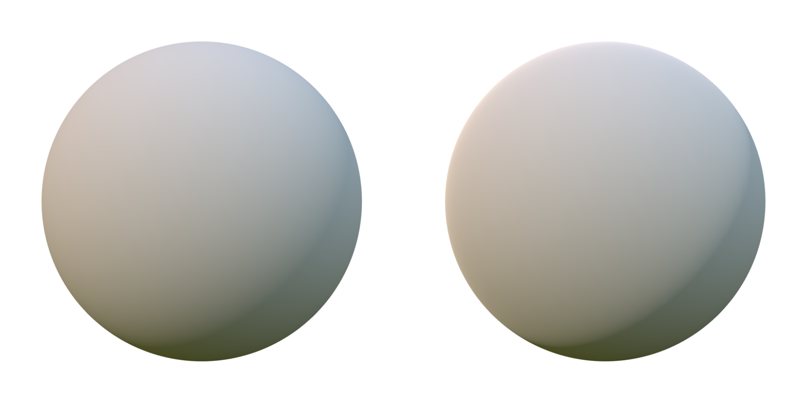

# 漫反射BRDF

在漫反射中,f<sub>m</sub>是一个Lambertian function，这时BRDF的漫反射公式就变成：


我们在实现是会用一个简化版的Lambertian BRDF，假设在所有微平面半球型区域上的漫反射都是一致的。


在实现中，我们将漫反射σ迟一点再乘:
```
float Fd_Lambert() {
    return 1.0 / PI;
}

vec3 Fd = diffuseColor * Fd_Lambert();
```

显然，Lambertian 漫反射BRDF是非常高效的，并且可以胜任于更复杂的模型。

然而，理想情况下，漫反射部分会与镜面反射部分保持一致，并且会将表面的粗糙度考虑在内。Disney 漫反射BRDF和Oren-Nayar模型，都将粗糙度考虑在内了，并会在掠射角内模拟出一些回复反射。但是，考虑我们进行的是实时渲染，而且这些额外的时间开销并不一定能带来质量上的提升。

下图展示了我们的Lambertian BRDF与Disney BRDF渲染一个完全粗糙的电介质材质的对比。结果非常相近，只是Disney渲染的在掠射角加了一些回复反射(仔细观察一下球的左边缘)。


Lambertian diffuse BRDF（左图）与Disney diffuse BRDF（右图）的对比


