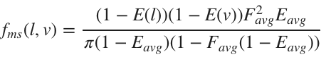
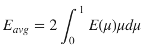
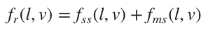

# 优化BRDFs

我们在前面提过能量守恒是一个优秀的BRDF的关键指标之一。不幸的是，我们在其中测试到了两个问题，下面将讨论这两个问题。

## 漫反射能量增益
待续

## 镜面反射中的能量流失
我们前面提到的Cook-Torrance BRDF尝试去模拟在微平面层面上的, 但那是建立在单次反射的基础上的。在单次反射模拟中，如果一束光在射在某一平面，然后又反射回另一个平面，结果就是它会被忽略。如果是多次反射模拟，同样一束光可以在两次或两次以上反射后离开平面，进入观察者眼中。


单次散射 VS 多次散射

基于上面的解释，我们可能会不由自主地想到，在非多次散射模拟下，是不是一个表面越粗糙，入射光流失的能量越多。这种能量损失可能会使粗糙的材质变暗。金属表面受影响特别大，因为他只有镜面反射。

下图展示了这种变暗效应：

单次反射：随着粗糙度增加，变暗效应越来越明显

下图

多次反射：防止了能量流失

我们再做一个实验来验证一下。我们把一个金属球体置于一个充满一致的纯白环境光的环境中。如果有没有能量流失时，它的金属表面(f<sub>0</sub> = 1)应该始终无法与背景区分开，也就是说你应该看不到这个球体。


单次反射：变暗效应越来越明显


多次反射：能量保存

一般的多反射微平面BRDF并不适用于实时渲染。Kulla and Conty另辟蹊径[Kulla17](#Kulla17),他们进行了能量补偿。公式如下：


其中，E是当f<sub>0</sub> = 1时，镜面反射分量f<sub>r</sub>的定向反射率。  


E<sub>avg</sub>是E的平均cos权重：  


F<sub>avg</sub>是菲涅耳项的平均cos权重：  


E和E<sub>avg</sub>都能被提前计算好，并存在查询表中。同时，F<sub>avg</sub>也能用Schlick近似大大简化。    


将这个新波瓣与原来的单反射波瓣结合：  
 

F<sub>avg</sub>可以被简化成f<sub>0</sub>,同时可以添加一个GGX高光波瓣来进行能量补偿。    
  
关键是E(l)不仅仅能够被提前计算，还可以与基于图像的照明预集成进行共享。最后，多反射能量补偿公式如下：    
  
r被定义为：  


我们把r保存在DFG查询表中，就可以以微乎其微的代价实现能量补偿。  
GLSL实现：  
```
vec3 energyCompensation = 1.0 + f0 * (1.0 / dfg.y - 1.0);
// Scale the specular lobe to account for multiscattering
Fr *= pixel.energyCompensation;
```


<span id="Kulla17">[Kulla17] Christopher Kulla and Alejandro Conty. 2017. Revisiting Physically Based Shading at Imageworks. ACM SIGGRAPH 2017
</span>