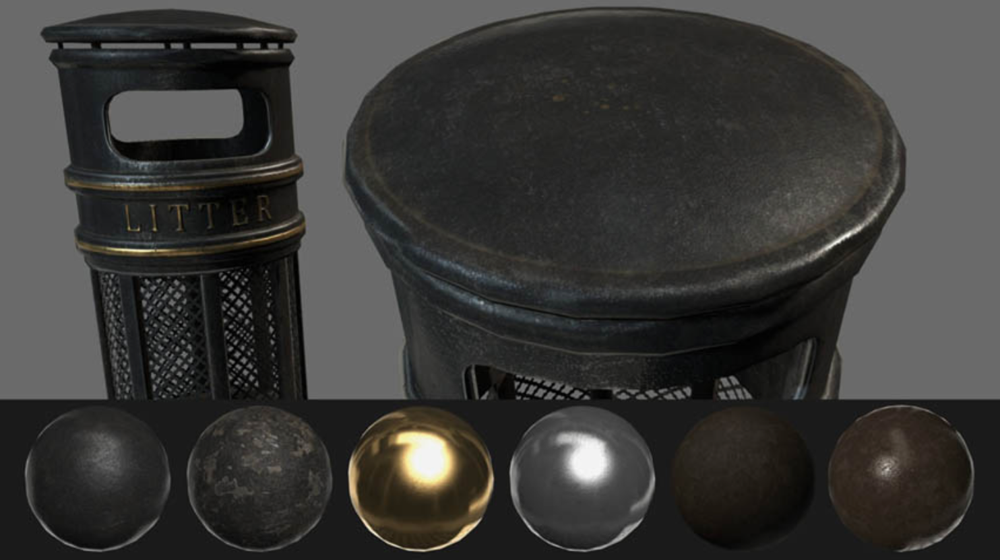
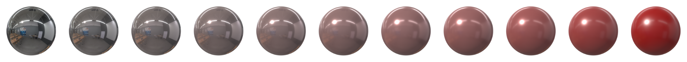

# 参数化

Disney的材质模型有太多参数，对实时渲染来说不太实际。另外，我们希望标准模型能易于理解，降低开发者和美术人员使用的门槛。

## 标准参数
参数 | 定义
---|:--:
BaseColor | 非金属表面的漫反射反射率和金属表面的高光颜色
Metallic | 0 或 1表示，无关表面是电介质还是导体
Roughness | 光滑(0.0)或粗糙(1,0)
Reflectance | 电介质表面上法线入射光的菲涅耳反射率
Emissive | 额外的漫反射去模拟自发光表面。在HDR通道中十分有用。
Ambient occlusion | 定义有多少自然光能到达表面。这是一个逐像素的遮蔽因素，取值范围0.0到1.0。

下图每行各自展示了金属性、粗糙度和反射率参数是怎么影响表面的外观的

从上到下：不同金属性，不同电介质粗糙度，不同金属粗糙度，不同反射率

## 类型和范围
理解我们的材质模型的不同参数的类型和范围十分重要。
参数 | 类型和范围
---|:--:
BaseColor | 线性RGB,[0..1] 
Metallic | 标量,[0..1]
Roughness | 标量,[0..1]
Reflectance | 标量,[0..1]
Emissive | 线性RGB,[0..1] + 曝光补偿
Ambient occlusion | 标量,[0..1].0到1.0。

这里定义的类型和范围描述了shader期望的输入，但API中的参数不一定与之一致。因为API要符合开发者和美术人员的使用习惯，这样的话就需要映射。比如API中baseColor参数是在sRGB空间中的，但是传递给shader是[0..1]，这里就需要把sRGB的值线性映射到[0...1]。

## 重新映射
下面是对baseColor,roughness和reflectance的重映射

### Base Color重映射
材料的基色受材质的“金属性”的影响。
漫反射颜色可以很容易地由baseColor计算得来。
```
vec3 diffuseColor = (1.0 - metallic) * baseColor.rgb
```

### Reflectance重映射

#### 电介质
菲涅耳依赖于f<sub>0</sub>, 法线方向上的镜面反射。对电介质而言其是消色的。我们会用下面的等式来对电介质表面重映射。


现在的目标就是把f<sub>0</sub>映射在既能表示非电解质表面(4% 反射率)，又能表示金属表面(8%到16%)的菲涅耳的范围上。下图展示了一些常见的值还有它们是怎么被映射的。


如果折射率已知（比如说,一个空气与水交界的平面折射率是1.33），则菲涅耳反射率就能够被计算出来：


反过来，如果反射率已知，那么我们也能计算出相应的折射率。


下面这个表格展示了几种不同种类的材质的菲涅耳反射率（现实世界中没有材质的该值在2%以下）

表4：常见材质的反射率

表五展示了一些金属的f<sub>0</sub>值, 值都以sRGB的形式给出。


下图展示了一个红色塑料球。如果仔细观察球体的边缘，您将能够注意到掠射角处的消色差镜面反射。


#### 导体
金属体表面的镜面反射是彩色的:


下面的等式展示了对于电介质和金属材质而言，f<sub>0</sub>是怎么计算出来的。
```
vec3 f0 = 0.16 * reflectance * reflectance * (1.0 - metallic) + baseColor * metallic;
```

### 粗糙度的重映射和限制
用户设置的粗糙度（此处称为perceptualRoughness）使用以下公式重新映射到线性范围


下图展示了不同粗糙度（0, 1)的金属银表面


第一列使用了重映射过的值，第二列是原始粗糙度值

## 混合与分层

通过对不同的参数进行插值，一个模型可以进行稳定的混合。特别是，这可以使用简单的遮盖来层叠不同的材质。

Ready工作室将许多简单材质(金，铜，木，铁锈等等）进行混合与分层，创造出了一个复杂的外观。



下图，展示了在闪亮的金属铬和粗糙的红色塑料之间进行的插值的结果。尽管，这种混合在物理学上来说毫无意义，但这种方法看起来效果很不错就行了。




## 制作基于物理的材质

想制作出基于物理的材质,你只需要关注四个主要参数：base color, metallic, roughness and reflectance。


下面简要地说下怎么使用我们的材质模型

所有材质：
    - **Base color** 不应该有照明信息
    - **Metallic** 几乎可以看成是一个二进制值，只有0、1。纯导体的该值为1，纯电介质该值为0。我们使用的值应该接近0或者1
非金属材质：
    - **Base color** 代表反射出来的颜色，应该是一个sRGB值，范围在[50, 240]
    - **Metallic** 应该为0或接近0的值
    - **Reflectance** 应该被设置为127sRGB(0.5, 4% 反射率)。不要在90sRGB(0.35linear, 2% 反射率)以下。
金属材质：
    - **Base color** 代表镜面反射颜色和反射率。亮度值在67％至100％（170-255 sRGB）。考虑到其中的非金属成分，氧化或肮脏的金属应使用比纯金属更低的光度。
    - **Metallic** 应该为1或接近1的值
    - **Reflectance** 被忽略


