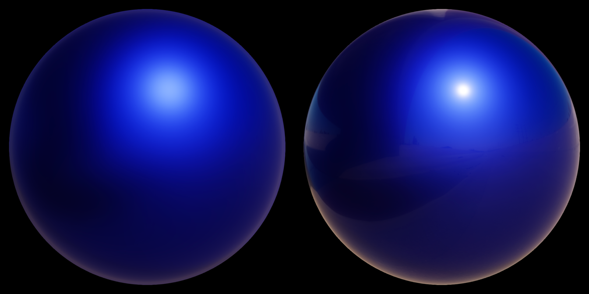
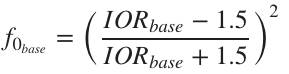

# 透明涂层(Clear coat)模型 
前面描述的标准材质模型很好地适用于单层材料的各向同性表面。不幸的是，多层材料相当普遍，尤其是在标准层之上有一层薄薄的半透明层的材料。真实世界的例子包括汽车涂料、汽水罐、漆木、丙烯酸树脂等。


标准材质模型（左）和透明涂层模型（右）

在标准材料模型的基础上，通过添加第二个镜面波瓣模拟出一个透明的涂层层，这意味着要计算第二个镜面BRDF。为了简化实现和参数化，透明涂层总是各向同性和介电性的。基础层可以是符合标准模型(介质或导体)的任何东西。

因为入射光可以穿过透明涂层，所以必须考虑能量的流失。同时Filament中的模型不会模拟内反射和折射。


## 透明涂层镜面BRDF
在标准模型中，透明涂层同样用Cook-Torrance微平面BRDF算法来模拟。因为透明涂层层总是有各向同性，介电性的，且粗糙度较低，所以我们可以使用性价比较高的DFG（法线分布函数）。

[Kelemen01](#Kelemen01)描述了一个能替代Smith-GGX可见性公式的更简单的公式。


这个可见性计算函数没有物理上的依据，但是它的简单正是实时渲染想要的。
GLSL实现：
```
float V_Kelemen(float LoH) {
    return 0.25 / (LoH * LoH);
}
```
总结下，我们的透明涂层BRDF还是一个Cook-Torrance镜面微平面模型，包括了GGX法线分布函数，Kelemen可见性函数，和Schlick 菲涅耳函数。

镜面BRDF中的菲涅耳项需要f<sub>0</sub>，它能够从表面折射率推算出来。我们先假设我们的透明涂层层由聚氨酯（一种用于涂料和清漆的常见化合物）构成，它的表面折射率是1.5，我们可以由此推算出f<sub>0</sub>。


结果是4%的菲涅耳反射率，对应普通介电材料。


<span id="Kelemen01">Csaba Kelemen et al. 2001. A Microfacet Based Coupled Specular-Matte BRDF Model with Importance Sampling. Eurographics Short Presentations.</span>

## 整合到原来的公式中
我们要考虑到透明涂层的能量流失，原来的公式变为：


F<sub>c</sub>是透明涂层BRDF的的菲涅耳项

## 透明涂层参数化
透明涂层材质模型包括了之前标准模型所有的参数，还要再加上两个额外的参数：
参数 | 定义
---|:--:
ClearCoat | 透明涂层的强度。范围在0和1之间
ClearCoatRoughness | 透明涂层的平滑度或粗糙度。范围在0和1之间


对于一个metallic设为1，roughness设为0.8的模型，Clear coat参数从0(左)到1（右）


对于一个metallic设为1，roughness设为0.8的模型，Clear coat roughness参数从0(左)到1（右）

重新映射，参数化和整合之后的透明涂层材料模型的GLSL实现。
```
void BRDF(...) {
    // compute Fd and Fr from standard model

    // remapping and linearization of clear coat roughness
    clearCoatPerceptualRoughness = clamp(clearCoatPerceptualRoughness, 0.089, 1.0);
    clearCoatRoughness = clearCoatPerceptualRoughness * clearCoatPerceptualRoughness;

    // clear coat BRDF
    float  Dc = D_GGX(clearCoatRoughness, NoH);
    float  Vc = V_Kelemen(clearCoatRoughness, LoH);
    float  Fc = F_Schlick(0.04, LoH) * clearCoat; // clear coat strength
    float Frc = (Dc * Vc) * Fc;

    // account for energy loss in the base layer
    return color * ((Fd + Fr * (1.0 - Fc)) * (1.0 - Fc) + Frc);
}
```

## 修改基础层
透明涂层的出现意味着我们要重新计算f<sub>0</sub>,因为原来的f<sub>0</sub>基于空气-材质表面。新的f<sub>0</sub>要基于透明图层-材质表面。

我们可以先由f<sub>0</sub>计算出基础层的折射率(IOR),再基于新IOR计算出新f<sub>0</sub>和涂明涂层的IOR。
1. 计算标准层的IOR：


2. 计算新f<sub>0</sub>



3. 因为透明图层的IOR是固定的，结合以上两式得：


