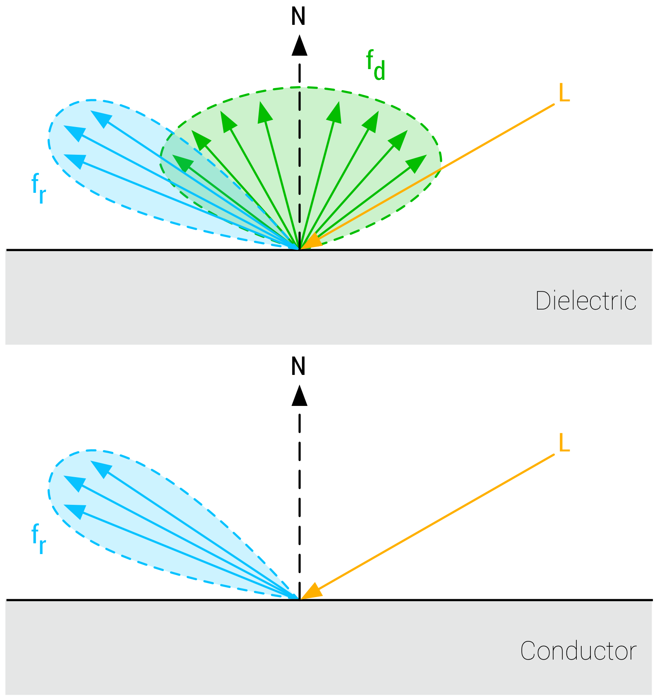
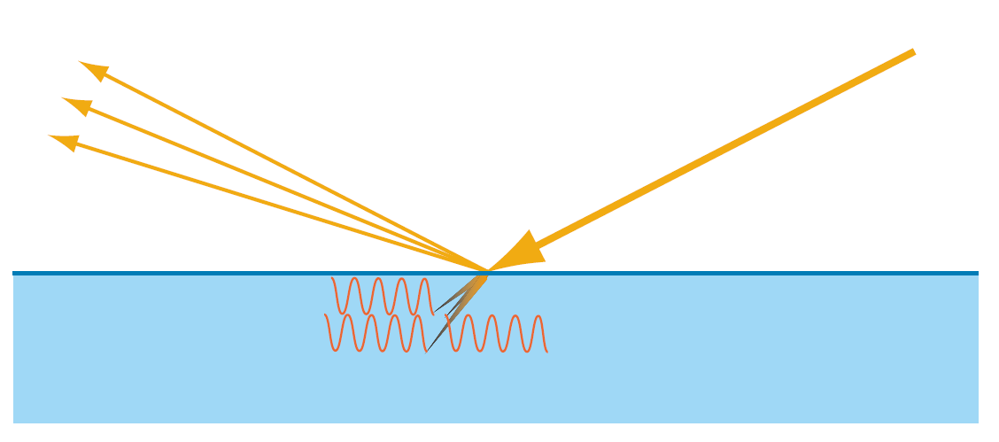

# 电介质和导体
为了更好地理解下面的一些方程和现象，我们必须首先清晰得理解金属（导体）和非金属（电介质）表面之间的区别。

我们在上一节看到入射光遇到用BRDF模拟的表面时, 光被反射为两部分：漫反射分量fd和镜面反射分量fr

这一模型大大简化了光遇到表面时的相互交互。实际上，部分入射光会穿透表面，在内部四处散射，最后再次作为漫反射分量离开表面。如下图：

电介质和导体的不同就在这里了。纯金属材料不会发生次表面散射，这意味着没有后续的漫反射分量（我们稍后会看到这会影响对我们镜面反射的颜色感知）。
下面两图展现了它们的区别：

在金属中，所有折射的光能立即被自由电子吸收,参考下图

