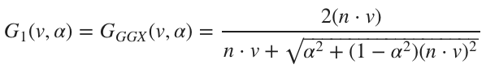

# 镜面的BRDF
Cook-Torrance 反射模型

在镜面反射中，f<sub>m</sub>是一个可以用菲涅耳定律建模的镜面BRDF，注意一下微平面模型积分的Cook-Torrance近似中的大F。

 

考虑到我们要进行实时渲染（这是一大限制），我们只能对D，G和F都只取近似值。[Brian Karis. 2013. Specular BRDF Reference](http://graphicrants.blogspot.com/2013/08/specular-brdf-reference.html)为这三个近似提供了相关的理论与公式, 都可用于Cook-Torrance镜面的BRDF。下面会介绍这逐一介绍这三个近似所使用的公式。

## 正态分布函数（大D）
Burley发现长尾正态分布函数(NDF, long-tailed normal distribution functions)很适合用于现实世界中的材质表面。在[Walter](https://knarkowicz.wordpress.com/2014/12/27/analytical-dfg-term-for-ibl/)中描述的GGX分布是一个在高光中长尾衰减和短峰值的分布,这个简单的公式很适合用在实时渲染。在现代物理渲染器中，它也是一种比较流行的模型，与Trowbridge-Reitz分布类似。

   

NDF的GLSL实现如下，简单又高效。
```
float D_GGX(float NoH, float roughness) {
    float a = NoH * roughness;
    float k = roughness / (1.0 - NoH * NoH + a * a);
    return k * k * (1.0 / PI);
}
```
接下来是在数学上对该公式的化简。

我们可以用来改进这个实现。同时在使用半精度浮点数前，我们还需要对原公式进行改进。因为在使用半精度浮点数时，计算1-（n · h)<sup>2</sup>会有两个问题。
1. 当（n · h)<sup>2</sup>接近1时会有浮点消除。
2. n · h在1附近时精确度不够。   

解决方案与拉格朗日相关：
|a x b|<sup>2</sup> = |a|<sup>2</sup>|b|<sup>2</sup> - (a · b)<sup>2</sup>  
因为n和h都是单位向量，所以|n x h|<sup>2</sup> = 1 - (n · h)<sup>2</sup>。我们就直接用1 - (n · h)<sup>2</sup>计算叉积。

下面是我们优化后对大D的实现
```
#define MEDIUMP_FLT_MAX    65504.0
#define saturateMediump(x) min(x, MEDIUMP_FLT_MAX)

float D_GGX(float roughness, float NoH, const vec3 n, const vec3 h) {
    vec3 NxH = cross(n, h);
    float a = NoH * roughness;
    float k = roughness / (dot(NxH, NxH) + a * a);
    float d = k * k * (1.0 / PI);
    return saturateMediump(d);
}
```

## 几何阴影（大G）
[Heitz](#Heitz)表示Smith几何阴影函数十分适用于表示大G。Smith公式如下：

   

G<sub>1</sub>可以依次遵循几个模型，通常设置为GGX公式：

   

故整个Smith-GGX公式变成：

   

显然通过引入可以让我们很容易地简化原公式分开的2(n · l)和2(n · v)


<span id="Heitz"> Eric Heitz. 2014. Understanding the Masking-Shadowing Function in Microfacet-Based BRDFs. Journal of Computer Graphics Techniques, 3 (2).</span>